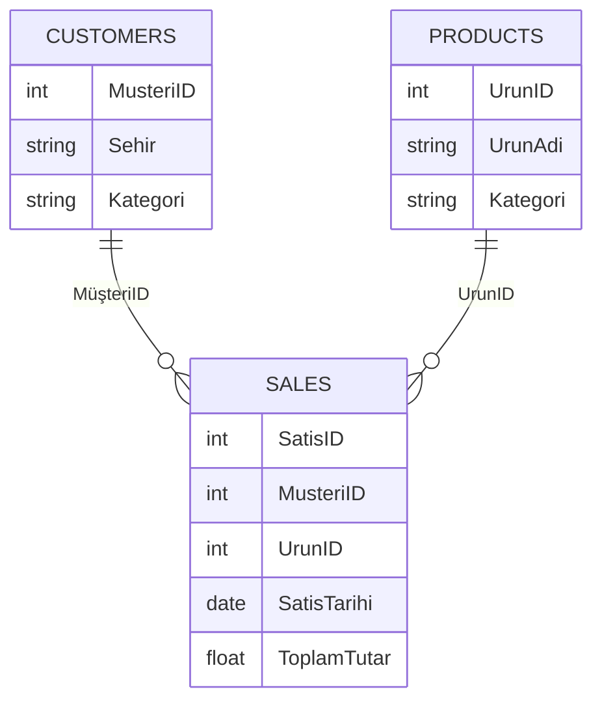

# Power BI Satış ve SaaS Analizleri

Satış operasyonu ile abonelik gelirlerini iki ayrı Power BI raporunda modelleyen iş zekâsı çalışmaları. Düzenlenebilir `.pbix` dosyaları ve kullanılan tüm yerel veri kaynakları birlikte sunulur.

## Dashboard dosyaları

| Dosya | Analiz odağı |
|---|---|
| `dashboards/sales.pbix` | Satış tutarı, ürün, müşteri, bölge, indirim, maliyet, iade ve teslimat analizi |
| `dashboards/saas.pbix` | Aylık yinelenen gelir (MRR), aktif/pasif müşteri ve dönemsel abonelik performansı |

PBIX dosyaları görüntülenmek ve düzenlenmek için Power BI Desktop ile açılmalıdır.

## Veri kaynakları

| Dosya | Boyut | Kullanım |
|---|---:|---|
| `data/powerbi_sales_dataset.xlsx` | 8.338 satır × 13 sütun | Ayrıntılı satış modeli |
| `data/saas_advanced.xlsx` | 1.021 satır × 4 sütun | Müşteri bazında aylık MRR |
| `data/sales_advanced.xlsx` | 1.400 satır × 8 sütun | Sipariş ve iskonto analizi |
| `data/sales_workbook.xlsx` | 607 satır × 5 sütun | Tarih, ürün ve bölge özeti |
| `data/customers.csv` | 15 satır × 5 sütun | Müşteri boyutu |
| `data/products.csv` | 15 satır × 6 sütun | Ürün boyutu |
| `data/sales.csv` | 55 satır × 10 sütun | Satış işlemleri |
| `data/powerbi_data.csv` | 56 satır × 8 sütun | Tek tablolu örnek satış verisi |

## Örnek veri modeli

## İncelenen metrikler

- Toplam satış ve sipariş hacmi
- Ürün, kategori, müşteri ve bölge kırılımları
- İndirim, maliyet ve iade etkisi
- Teslimat süresi ve ödeme yöntemi dağılımı
- MRR gelişimi ve müşteri durumu

## Açma

1. Power BI Desktop’ı açın.
2. `dashboards/` altındaki ilgili PBIX dosyasını seçin.
3. Veri kaynağı yolu istenirse aynı klasör yapısındaki `data/` dosyasını gösterin.

## Teknolojiler

Power BI Desktop, Power Query, DAX, CSV ve Excel.
