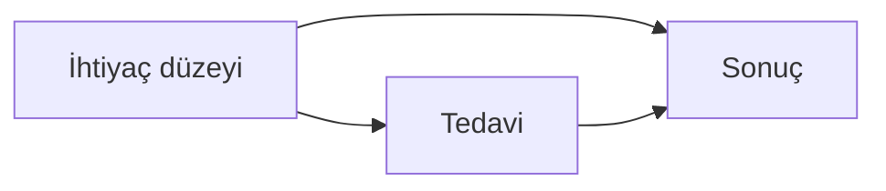
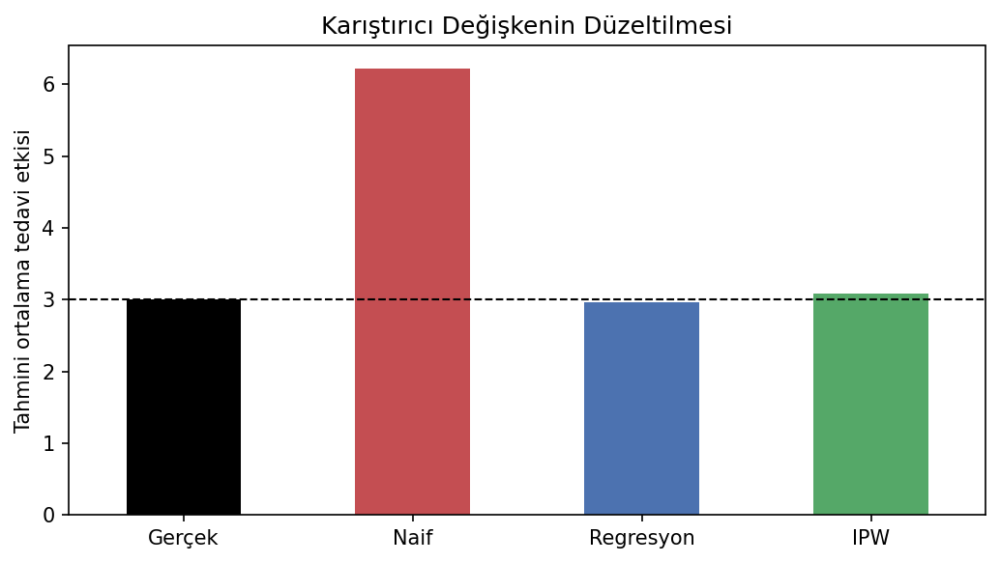

# Karıştırıcı Değişken Altında Tedavi Etkisi Tahmini

Naif grup farkının karıştırıcı bir değişken nedeniyle nasıl yanlı hale geldiğini ve bu yanlılığın regresyon ile propensity score ağırlıklandırması kullanılarak nasıl azaltılabildiğini gösteren nedensel çıkarım çalışması.

## Problem

Tedavi alan ve almayan grupların sonuç ortalamalarını doğrudan karşılaştırmak her zaman nedensel etkiyi vermez. Bu deneyde `need` değişkeni hem tedavi alma olasılığını hem de sonucu etkilediği için bir karıştırıcıdır.



## Veri üretimi

Sabit tohumla 5.000 gözlem oluşturulur. Gerçek ortalama tedavi etkisi **3,0** olarak tanımlanır. Depodaki CSV, veri üretim sürecinden alınmış 1.000 satırlık okunabilir örnektir; kod deneyi tam örneklem üzerinde yeniden üretir.

| Dosya | Değişkenler |
|---|---|
| `data/synthetic_treatment_data.csv` | `need`, `treatment`, `outcome` |

## Tahmin yöntemleri

- Naif tedavi–kontrol ortalama farkı
- `need` değişkenini kontrol eden doğrusal regresyon
- Lojistik regresyonla propensity score ve ters olasılık ağırlıklandırması (IPW)

## Sonuçlar

| Tahmin | Ortalama tedavi etkisi | Gerçek etkiden sapma |
|---|---:|---:|
| Gerçek değer | 3,000 | 0,000 |
| Naif fark | 6,225 | +3,225 |
| Regresyon düzeltmesi | 2,960 | -0,040 |
| IPW | 3,080 | +0,080 |

Naif karşılaştırma etkiyi yaklaşık iki katına çıkarırken iki düzeltme yöntemi gerçek değere yaklaştı. Sonuç, nedensellik için model doğruluğundan önce veri üretim mekanizmasının ve karıştırıcıların tanımlanması gerektiğini gösterir.



## Çalıştırma

```bash
pip install -r requirements.txt
python nedensel_cikarim.py
```

## Teknolojiler

Python, pandas, NumPy, Matplotlib ve scikit-learn.
