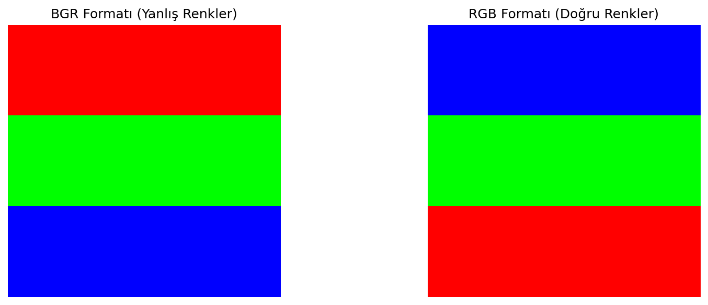
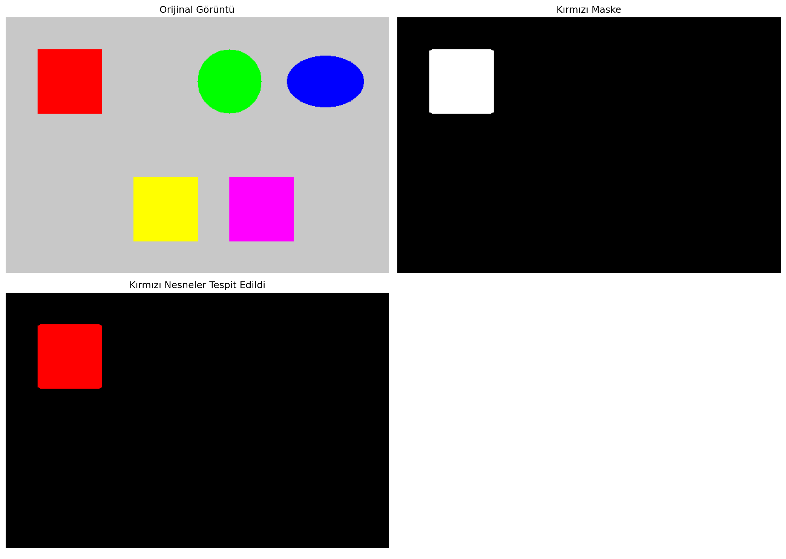
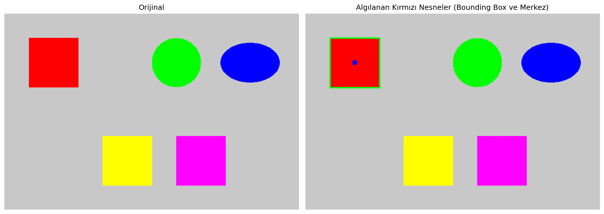
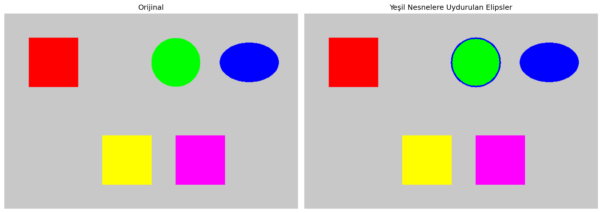

# Renk Uzaylarıyla Nesne Tespiti

RGB/BGR, HSV, LAB ve YCrCb renk uzaylarını karşılaştıran; HSV maskeleme ve kontur geometrisiyle renk tabanlı nesne tespiti yapan klasik computer vision uygulaması.

## Amaç

Nesne tespitini yalnızca derin öğrenme problemi olarak ele almak yerine, rengin ayırt edici olduğu durumlarda açıklanabilir ve düşük maliyetli bir görüntü işleme hattı kurmak.

## Neden HSV?

RGB kanalları renk ve parlaklığı birlikte taşır. HSV uzayı tonu parlaklıktan ayırdığı için belirli bir renk için alt-üst sınır tanımlamak daha doğrudandır. Kırmızının hue ekseninin iki ucunda bulunması nedeniyle iki ayrı maske oluşturulup birleştirilmiştir.

## Veri ve İş Akışı

`data/color_blocks.png` renk dönüşümlerini göstermek için kullanılan yerel girdidir. Betik ayrıca kırmızı dikdörtgen, yeşil daire, mavi elips ve farklı renk bloklarından oluşan sentetik bir test görüntüsü üretir.

1. BGR görüntüyü RGB, HSV, LAB ve YCrCb uzaylarına dönüştürme
2. HSV aralıklarıyla kırmızı, yeşil ve mavi maskeleri çıkarma
3. Morfolojik işlemlerle maskeyi temizleme
4. Kontur, merkez, bounding box, elips ve çevresel daire hesaplama

## Sonuçlar

| Ölçüm | Değer |
|---|---:|
| Kırmızı piksel | 10.177 |
| Görüntüde kırmızı oranı | %4,24 |
| Kırmızı nesne alanı | 9.980 piksel² |
| Kırmızı nesne sınıfı | Yuvarlak/Daire |

### Renk uzayı dönüşümü



### HSV ile maskeleme



### Konum ve geometri çıkarımı

| Bounding box | Elips uydurma |
|---|---|
|  |  |

## Çalıştırma

```bash
pip install -r requirements.txt
python renk_uzaylari.py
```

**Teknolojiler:** Python, NumPy, OpenCV, Matplotlib
