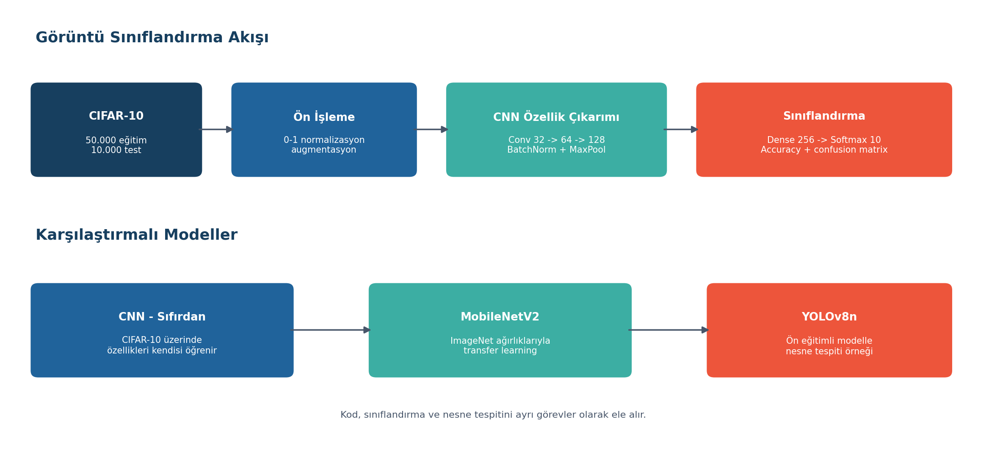

# CNN, Transfer Learning ve YOLO

Görüntü sınıflandırması ile nesne tespitinin farklı görevler olduğunu gösteren üç parçalı computer vision çalışması: CIFAR-10 üzerinde sıfırdan CNN, MobileNetV2 ile transfer learning ve YOLOv8n ile çıkarım.

## Çalışmanın Kapsamı

- CIFAR-10 görüntülerini 0-1 aralığına normalleştirme
- Döndürme, kaydırma, yatay çevirme ve zoom augmentasyonu
- Üç convolution bloğu ve yoğun sınıflandırma katmanı
- Eğitim/doğrulama eğrileri, test tahminleri ve confusion matrix
- ImageNet ağırlıklı MobileNetV2 ile karşılaştırma
- COCO sınıfları üzerinde YOLOv8n inference örneği

## CNN Mimarisi

Filtre sayısı 32, 64 ve 128 olarak artan Conv2D bloklarında Batch Normalization, MaxPooling ve Dropout kullanılır. Flatten katmanından sonra 256 nöronlu yoğun katman ve 10 sınıflı softmax çıkışı bulunur. Early stopping ve öğrenme oranı azaltma callback'leri aşırı öğrenmeyi sınırlamak için eklenmiştir.

## Veri Seti

CIFAR-10; 32×32 RGB görüntülerden oluşan 10 sınıflı standart bir veri setidir. 50.000 eğitim ve 10.000 test görüntüsü Keras tarafından ilk çalıştırmada indirilir. Açılmış veri yaklaşık 170 MB olduğu için GitHub paketine eklenmemiştir; bu istisna `data/README.md` içinde de açıklanır.

## Akış



## Çalıştırma

```bash
pip install -r requirements.txt
python cnn_yolo.py
```

İlk çalıştırmada CIFAR-10, ImageNet ağırlıkları ve YOLO ağırlıkları indirileceği için internet bağlantısı gerekir. Eğitim süresi donanıma göre değişir; GPU kullanılmadığında tam akış uzun sürebilir.

**Teknolojiler:** Python, TensorFlow/Keras, OpenCV, scikit-learn, Ultralytics YOLO, Matplotlib
