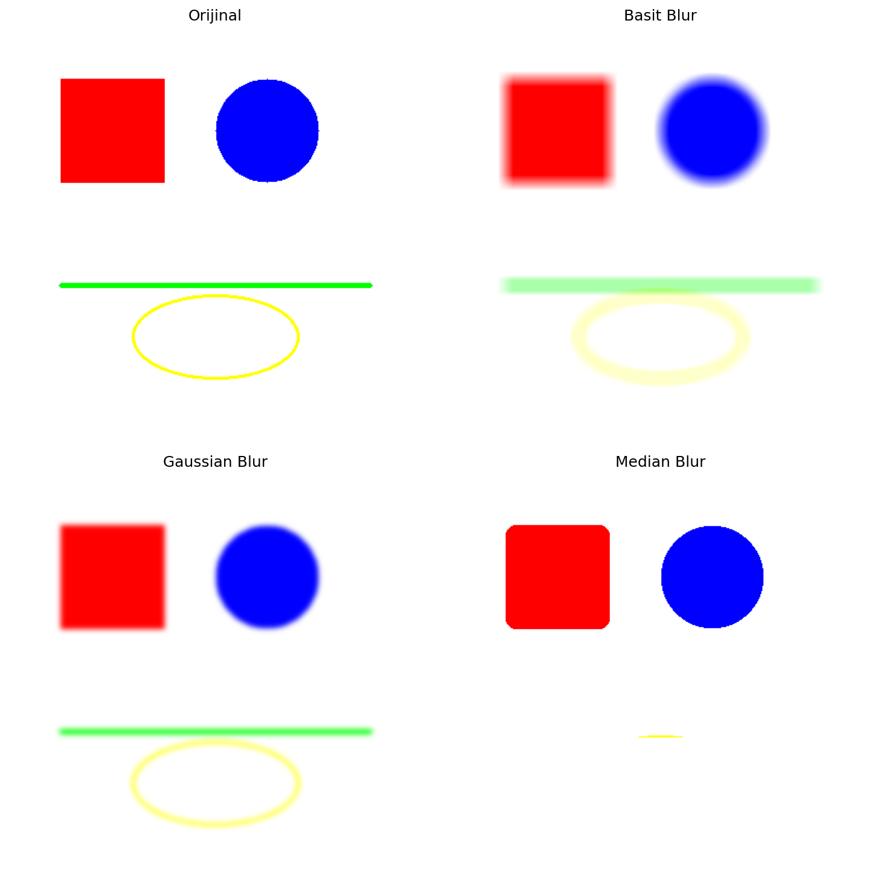
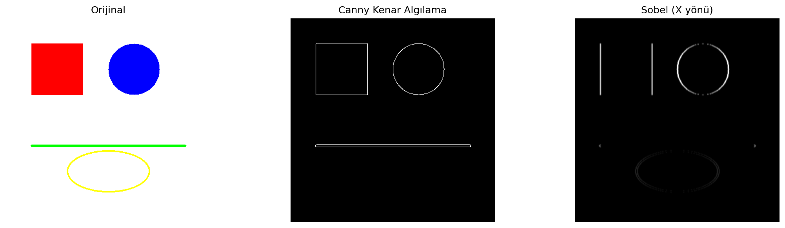
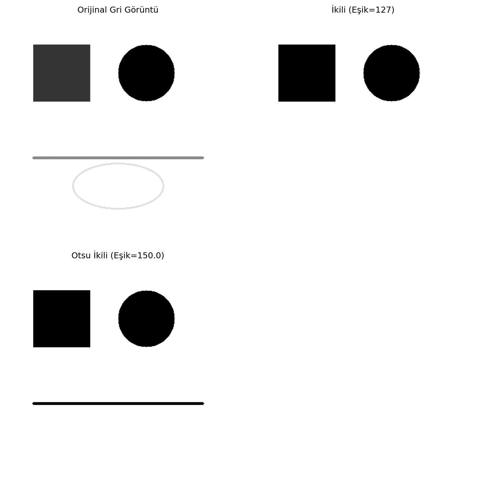
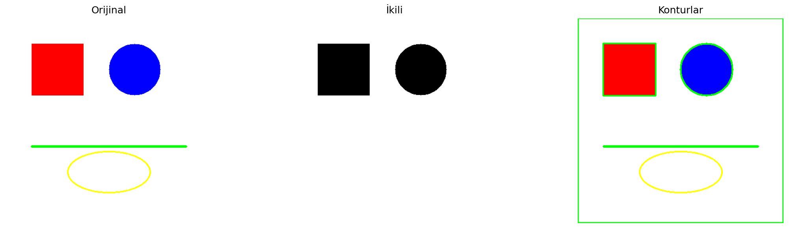

# Görüntü İşleme Temelleri

OpenCV ve NumPy kullanarak görüntünün bir piksel matrisi olarak nasıl temsil edildiğini ve temel görüntü işleme adımlarının bu matris üzerinde nasıl çalıştığını gösteren uygulama.

## Amaç

Renk kanalı düzenleme, geometrik dönüşüm, filtreleme, kenar bulma, eşikleme ve kontur çıkarma işlemlerini tek bir akışta uygulamak. Çalışma hazır bir fotoğrafa bağlı değildir; girdi görüntüleri kodla oluşturulduğu için sonuçlar tekrar üretilebilir.

## Uygulanan İşlemler

- BGR ve RGB kanal düzeni
- Yeniden boyutlandırma ve 45 derece döndürme
- Gri tonlama, ortalama, Gaussian ve median filtreler
- Canny ve Sobel kenar algılama
- Sabit eşik ve Otsu eşikleme
- Erosion, dilation, opening ve closing
- Kontur alanı ve çevre uzunluğu hesaplama

## Veri

`data/shapes_reference.png` temel geometrik şekilleri içeren örnek girdidir. Betik ayrıca aynı klasöre siyah tuval, renk bantları ve şekil görüntülerini üretir.

## Çıktılar

| Kontrol | Sonuç |
|---|---:|
| Görüntü boyutu | 400 × 400 × 3 |
| Otsu eşiği | 150 |
| Bulunan kontur | 3 |
| Histogram piksel toplamı | 160.000 |

### Filtreleme karşılaştırması



### Kenar algılama



### Eşikleme ve konturlar

| Eşikleme | Kontur tespiti |
|---|---|
|  |  |

## Çalıştırma

```bash
pip install -r requirements.txt
python goruntu_isleme.py
```

**Teknolojiler:** Python, NumPy, OpenCV, Matplotlib, Pillow
