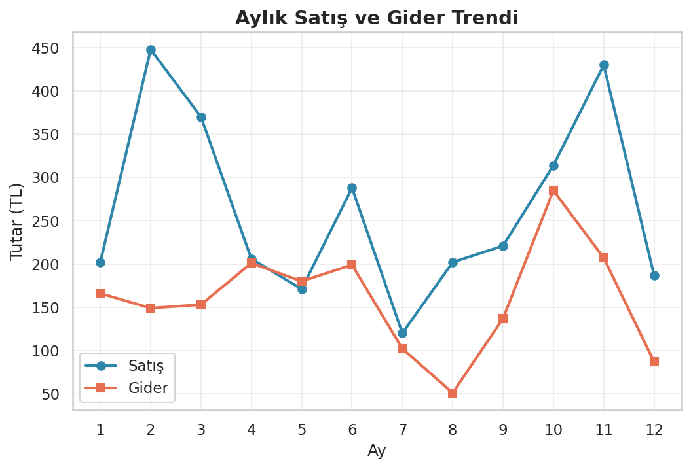
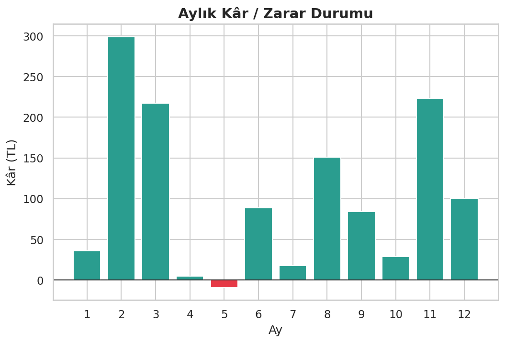
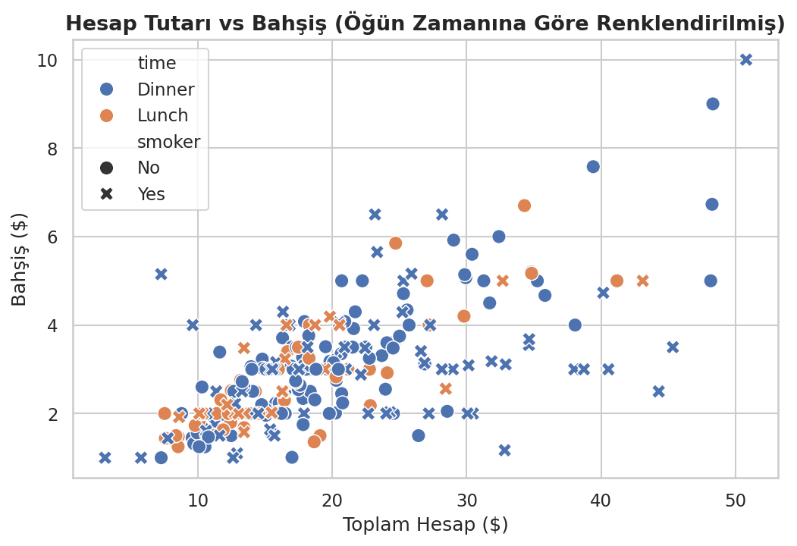
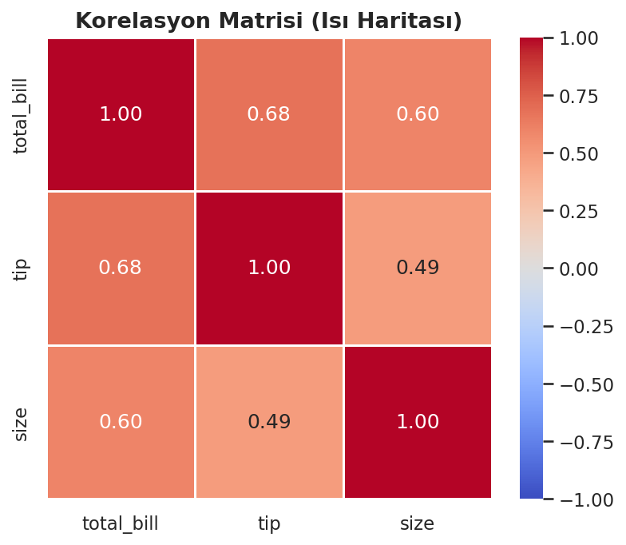
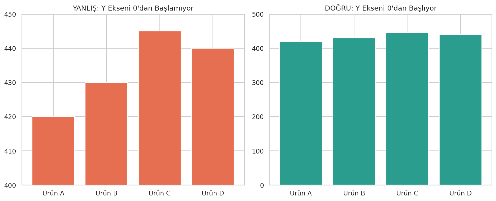
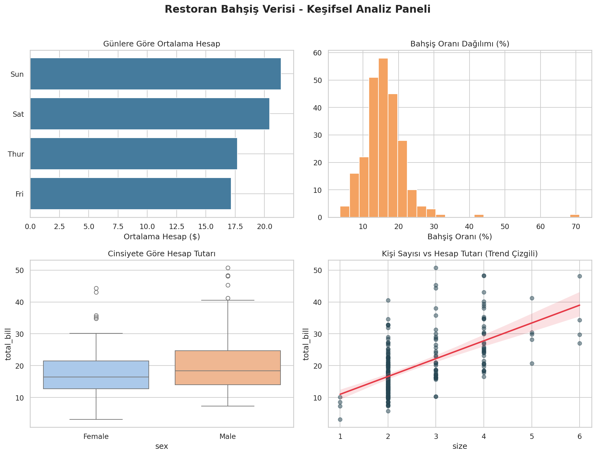

# Python Veri Görselleştirme Rehberi

Matplotlib, Seaborn ve Plotly kullanarak grafik türü seçimini, görsel tasarım ilkelerini ve statik–etkileşimli çıktı üretimini gösteren uygulamalı rehber.

## Kapsam

| Analiz ihtiyacı | Kullanılan görsel |
|---|---|
| Zaman içindeki değişim | Çizgi grafiği |
| Kategori karşılaştırması | Bar grafiği |
| Dağılım ve aykırı değer | Histogram, boxplot, violin plot |
| İki sayısal değişken ilişkisi | Scatter plot, regresyon grafiği |
| Çok değişkenli ilişki | Pairplot, korelasyon ısı haritası |
| Birden fazla KPI | Çoklu grafik paneli |
| Kullanıcı etkileşimi | Plotly HTML grafikleri |

## Veri setleri

- Aylık satış, gider ve kâr verileri kod içinde sabit tohumla üretilir.
- Restoran hesabı ve bahşiş analizinde yerel `data/tips.csv` kullanılır.

| Dosya | Boyut | Değişkenler |
|---|---:|---|
| `data/tips.csv` | 244 satır × 7 sütun | Hesap, bahşiş, gün, zaman, kişi sayısı ve kategoriler |

## Öne çıkan çıktılar

| Aylık satış ve gider | Aylık kâr/zarar |
|---|---|
|  |  |

| Hesap–bahşiş ilişkisi | Korelasyon matrisi |
|---|---|
|  |  |

| Görsel tasarım karşılaştırması | Uçtan uca EDA paneli |
|---|---|
|  |  |

Plotly ile üretilen etkileşimli çıktılar `figures/interactive_scatter.html` ve `figures/interactive_trend.html` dosyalarında bulunur. GitHub HTML dosyasını kaynak olarak gösterir; tam etkileşim için dosyanın yerel tarayıcıda açılması gerekir.

## Çalıştırma

```bash
pip install -r requirements.txt
python veri_gorsellestirme.py
```

Kod tüm statik grafikleri `figures/` klasörüne, etkileşimli grafikleri HTML olarak aynı klasöre kaydeder.

## Teknolojiler

Python, pandas, NumPy, Matplotlib, Seaborn ve Plotly.
