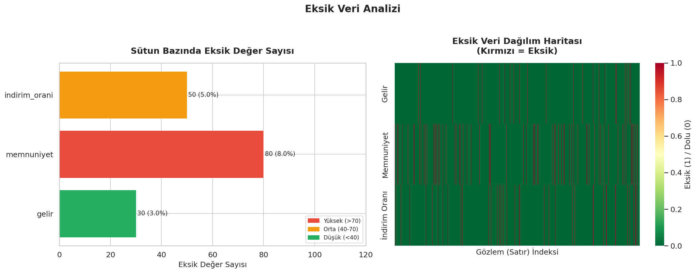
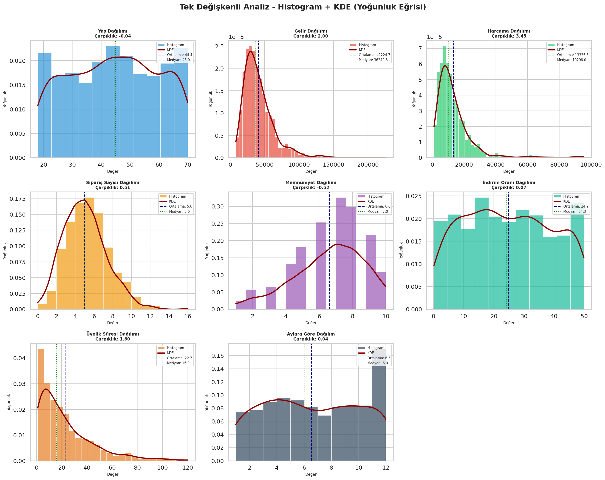
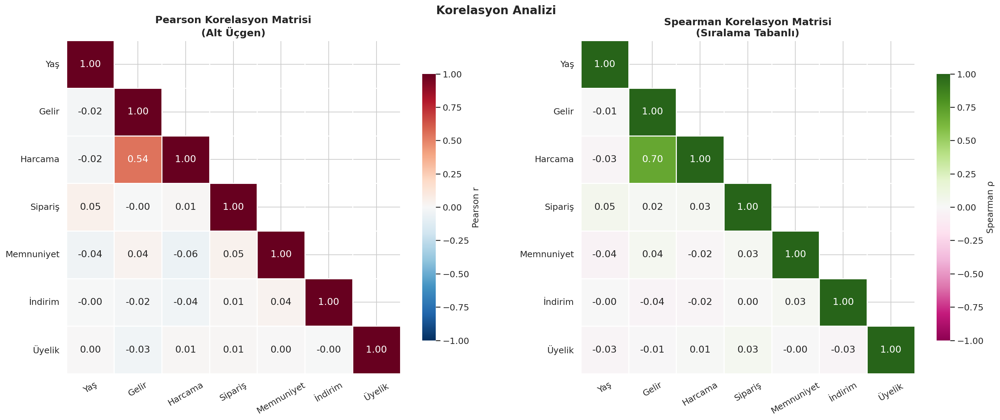
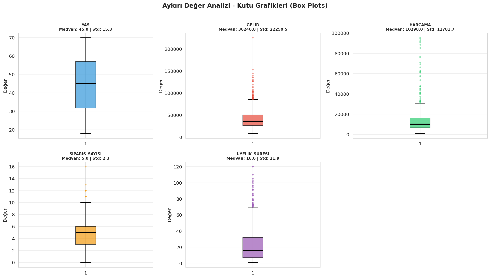
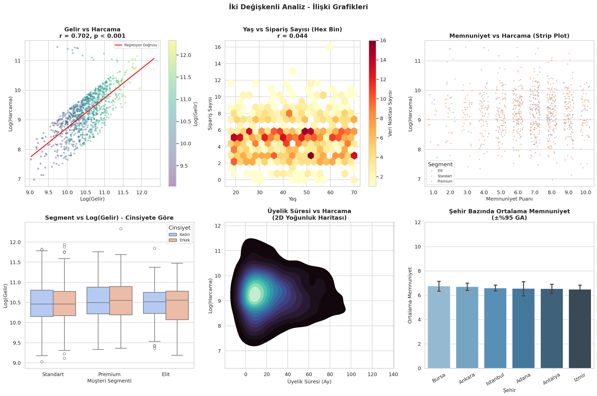
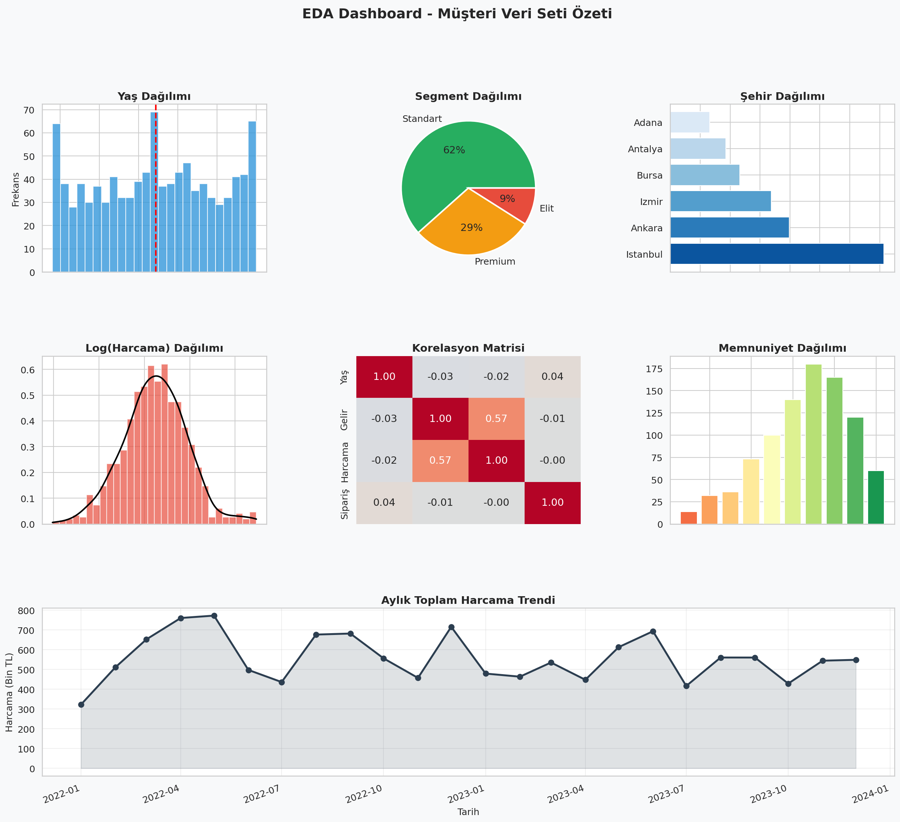

# Uçtan Uca Keşifsel Veri Analizi İş Akışı

Yeni bir tabloyu modelleme öncesinde sistematik biçimde tanımak için veri kalitesi, dağılım, ilişki, aykırı değer ve zaman davranışı kontrollerini tek akışta birleştiren çalışma.

## Veri seti

Müşteri demografisi, davranışı ve tarih alanlarını içeren sentetik veri sabit tohumla oluşturulmuş ve tekrar kullanılabilmesi için CSV olarak saklanmıştır.

| Dosya | Boyut | İçerik |
|---|---:|---|
| `data/synthetic_customers.csv` | 1.000 satır × 13 sütun | Sayısal, kategorik ve tarih değişkenleri |

## Kontrol listesi

1. Boyut, veri türü, benzersiz değer ve temel istatistik kontrolü
2. Eksik değer oranlarının ölçülmesi
3. Sayısal değişkenlerin dağılım ve normallik incelemesi
4. Kategorik frekansların karşılaştırılması
5. IQR ve boxplot ile aykırı değer taraması
6. Korelasyon ve çift değişkenli ilişki analizi
7. Tarih alanlarından dönemsel örüntü çıkarma
8. Bulguları tek EDA panelinde özetleme

## Görsel bulgular

| Veri kalitesi | Sayısal dağılımlar |
|---|---|
|  |  |

| Korelasyon yapısı | Aykırı değer taraması |
|---|---|
|  |  |

| Değişken ilişkileri | Analiz özeti |
|---|---|
|  |  |

Bu çalışma bir tahmin modeli kurmaz. Çıktılar, sonraki veri temizleme ve modelleme kararlarının hangi kanıta dayanacağını belirlemek için kullanılır.

## Çalıştırma

```bash
pip install -r requirements.txt
python eda_is_akisi.py
```

## Teknolojiler

Python, pandas, NumPy, Matplotlib, Seaborn ve SciPy.
