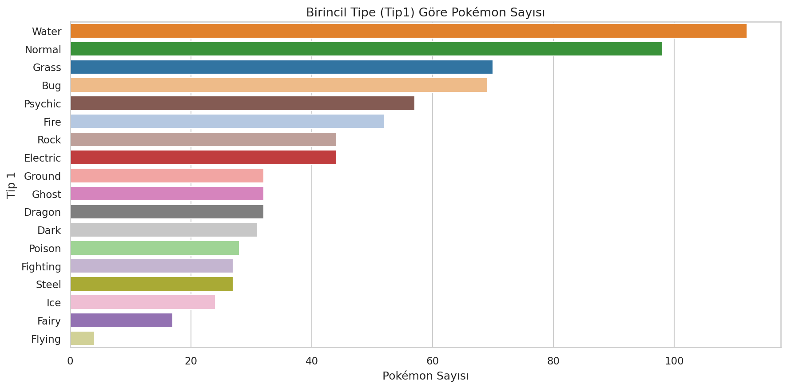
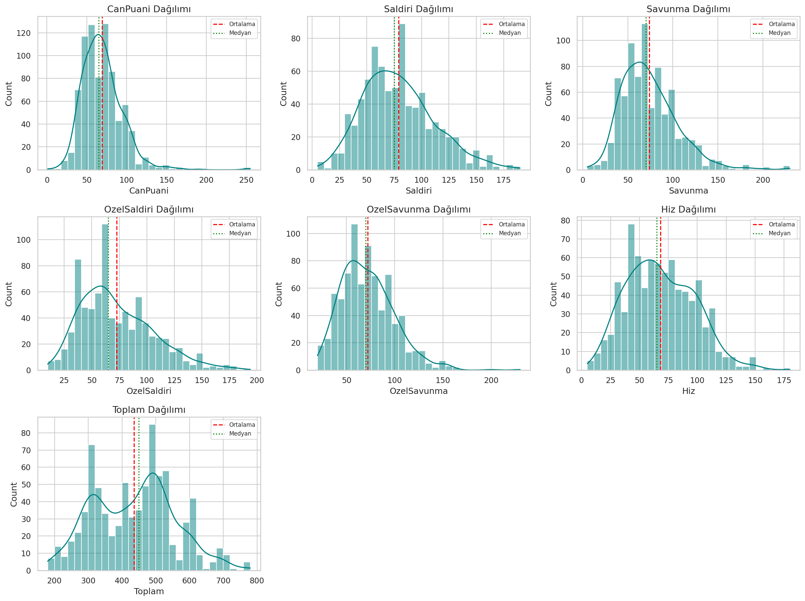
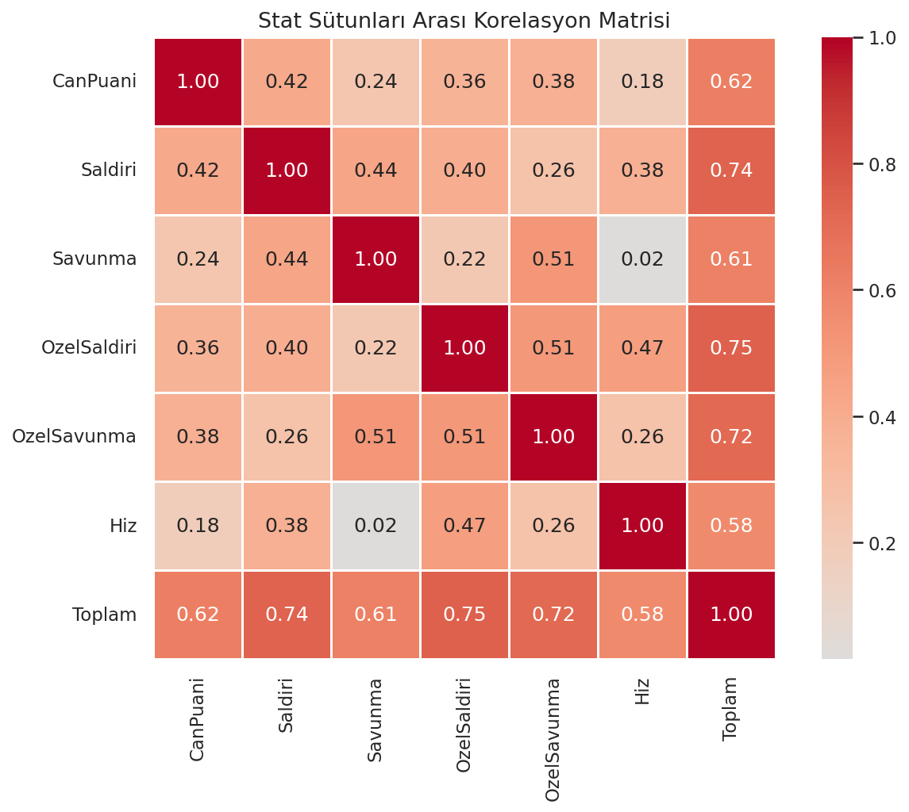
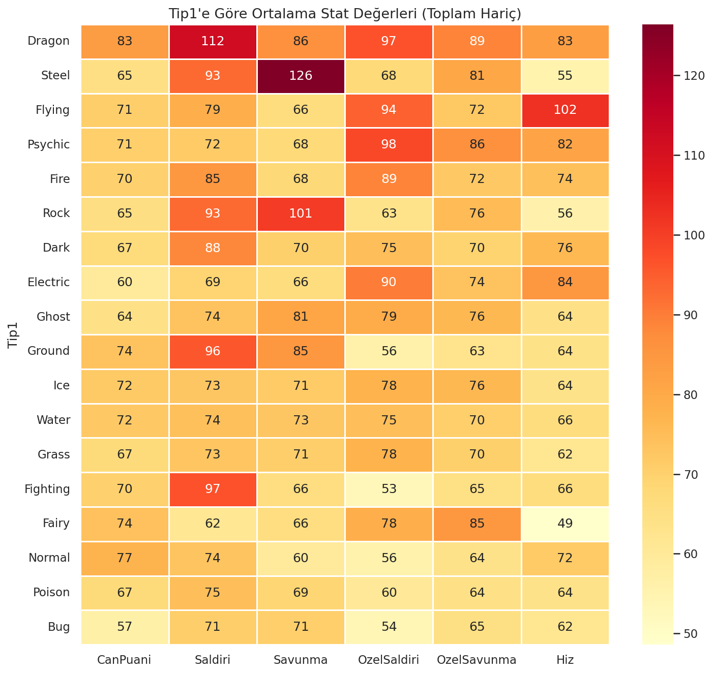
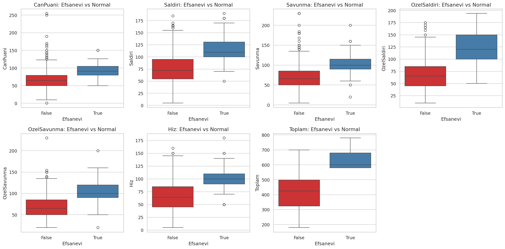
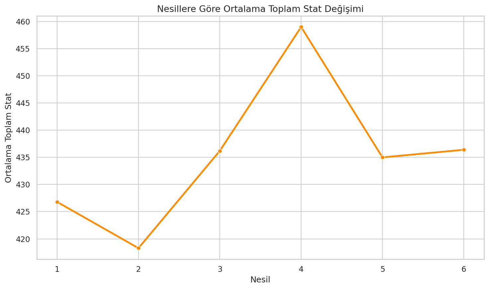

# Pokémon Keşifsel Veri Analizi

Pokémon istatistiklerinin dağılımlarını; tip, nesil ve efsanevi olma durumuna göre karşılaştıran kapsamlı keşifsel veri analizi.

## Veri seti

| Dosya | Boyut | Temel alanlar |
|---|---:|---|
| `data/pokemon.csv` | 800 satır × 13 sütun | Tip, HP, saldırı, savunma, hız, nesil ve efsanevi etiketi |

## Analiz soruları

- Sayısal istatistikler nasıl dağılıyor?
- İkinci tip bilgisinde ne kadar eksiklik var?
- Hangi birincil tipler daha sık görülüyor?
- Toplam güçle en güçlü ilişkiyi hangi özellikler kuruyor?
- Efsanevi Pokémon’lar temel istatistiklerde nasıl ayrışıyor?
- Nesiller arasında güç veya efsanevi oranı değişiyor mu?

## Bulgular

- 800 Pokémon ve 13 değişken analiz edildi.
- `Type 2` alanındaki eksiklik, veri hatası değil tek tipli Pokémon’ları temsil eden yapısal bir eksikliktir.
- Toplam güçle en belirgin doğrusal ilişkiler özel saldırı ve saldırı değişkenlerinde görüldü.
- Efsanevi Pokémon’ların toplam güç dağılımı genel gruba göre daha yüksek seviyede yoğunlaştı.

## Görseller

| Tip dağılımı | İstatistik dağılımları |
|---|---|
|  |  |

| Korelasyon matrisi | Tip bazında istatistikler |
|---|---|
|  |  |

| Efsanevi karşılaştırması | Nesil eğilimi |
|---|---|
|  |  |

## Çalıştırma

```bash
pip install -r requirements.txt
python pokemon_eda.py
```

## Teknolojiler

Python, pandas, NumPy, Matplotlib, Seaborn ve SciPy.
