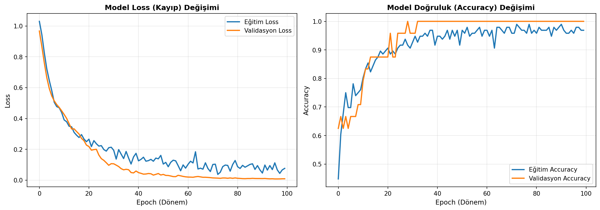
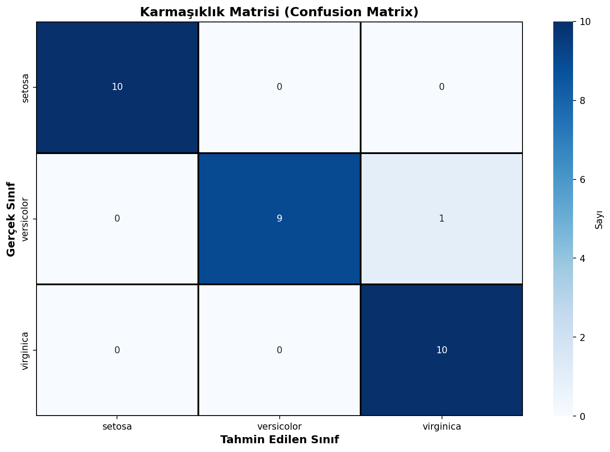
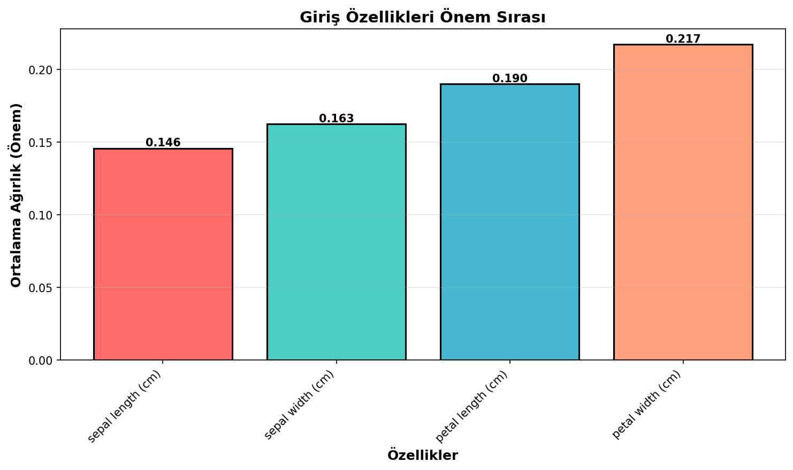

# Iris Sınıflandırması - Yapay Sinir Ağı

Iris çiçeklerini dört ölçümden üç türe ayıran, TensorFlow/Keras ile geliştirilmiş çok katmanlı sınıflandırma modeli.

## Amaç ve Model Tercihi

Bu çalışmanın amacı yoğun katman, aktivasyon fonksiyonu, dropout, softmax ve categorical cross-entropy bileşenlerini küçük ve dengeli bir veri seti üzerinde birlikte uygulamaktır. Iris problemi doğrusal olmayan çok sınıflı karar sınırlarını gözlemlemek için kompakt bir örnek sunar.

## Veri Seti

`data/iris.csv` dosyasında 150 gözlem, dört sayısal özellik ve üç dengeli sınıf bulunur. Veri stratified olarak 120 eğitim ve 30 test gözlemine ayrılmış, özellikler yalnızca eğitim verisine göre standartlaştırılmıştır.

## Mimari

`4 -> 64 -> 32 -> 16 -> 3` katman yapısı kullanılmıştır. Gizli katmanlarda ReLU, ilk iki katmandan sonra %30 dropout ve çıkışta softmax uygulanmıştır. Model 2.979 eğitilebilir parametreye sahiptir.

## Sonuçlar

| Metrik | Değer |
|---|---:|
| Test accuracy | %96,67 |
| Macro precision | 0,9697 |
| Macro recall | 0,9667 |
| Macro F1 | 0,9666 |
| Test loss | 0,1081 |

Setosa örneklerinin tamamı doğru sınıflandırılmıştır. Tek hata versicolor-virginica sınırında oluşmuştur; bu iki sınıfın ölçüm dağılımları birbirine daha yakındır.

### Eğitim eğrileri



### Karmaşıklık matrisi ve giriş ağırlıkları

| Confusion matrix | Giriş ağırlıklarının büyüklüğü |
|---|---|
|  |  |

## Çalıştırma

```bash
pip install -r requirements.txt
python yapay_sinir_aglari.py
```

**Teknolojiler:** Python, TensorFlow/Keras, scikit-learn, pandas, NumPy, Matplotlib, Seaborn
