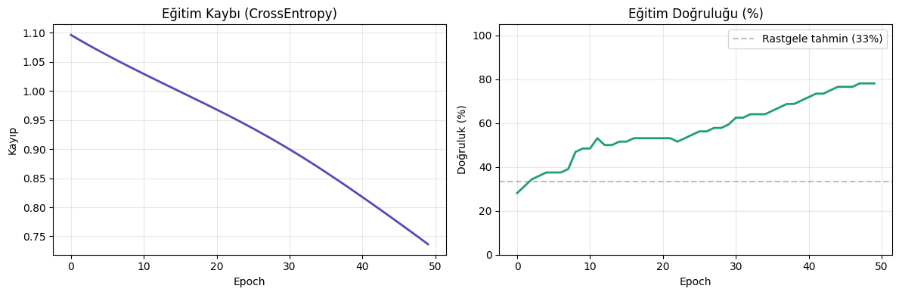
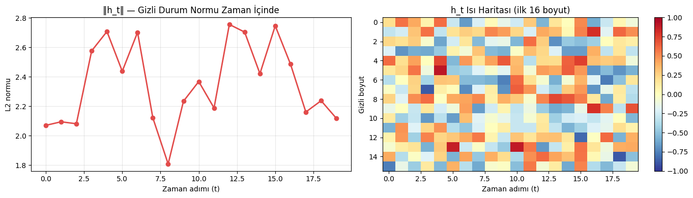
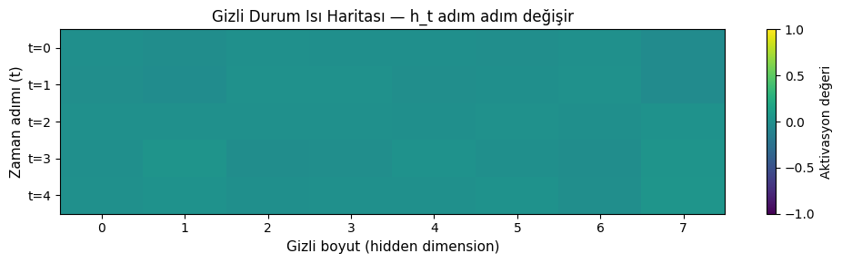
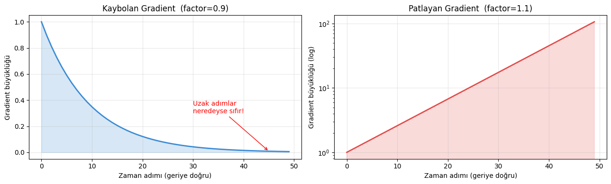
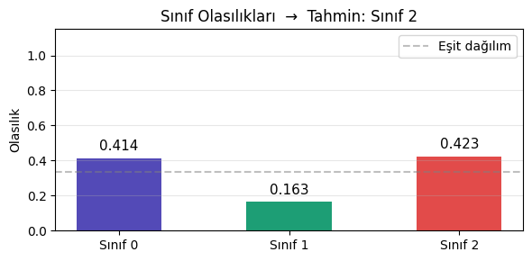

# RNN ile Sıralı Veri Sınıflandırması

Tekrarlayan sinir ağlarında gizli durumun zaman boyunca nasıl taşındığını önce NumPy ile tek hücre düzeyinde, ardından PyTorch ile uçtan uca sınıflandırıcı üzerinde inceleyen çalışma.

## Amaç

Bağımsız satırlardan farklı olarak sıralı veride gözlemlerin sırası bilgi taşır. RNN, önceki adımın gizli durumunu yeni girdiyle birleştirerek dizinin bağlamını günceller.

## Veri seti

Bu çalışma gerçek bir alan probleminde başarı iddiası yerine mimari davranışı görünür kılan kontrollü sentetik diziler kullanır.

| Dosya | İçerik |
|---|---|
| `data/sequence_classification_sample.npz` | Sabit tohumla üretilmiş giriş dizileri ve sınıf etiketleri |

## Uygulama akışı

1. NumPy ile `tanh` aktivasyonlu tek RNN hücresi yazma
2. Her zaman adımındaki gizli durumu izleme
3. PyTorch `nn.RNN` ve doğrusal çıkış katmanıyla üç sınıflı model kurma
4. Cross-entropy ve Adam ile 50 epoch eğitim
5. Sınıf olasılıklarını ve gizli durum normlarını inceleme
6. Kaybolan ve patlayan gradyan davranışını görselleştirme

## Yorum

Model sentetik ve rastgele etiketli küçük bir örnek üzerinde mimari gösterim amacıyla çalışır; raporlanan eğitim doğruluğu gerçek dünya genelleme ölçütü değildir. Gradyan grafiği, uzun dizilerde Vanilla RNN yerine LSTM veya GRU tercih edilmesinin temel nedenini açıklar.

## Görseller

| Eğitim eğrileri | Gizli durum izleme |
|---|---|
|  |  |

| Gizli durum ısı haritası | Gradyan davranışı |
|---|---|
|  |  |



## Çalıştırma

```bash
pip install -r requirements.txt
python rnn.py
```

## Teknolojiler

Python, NumPy, Matplotlib ve PyTorch.
