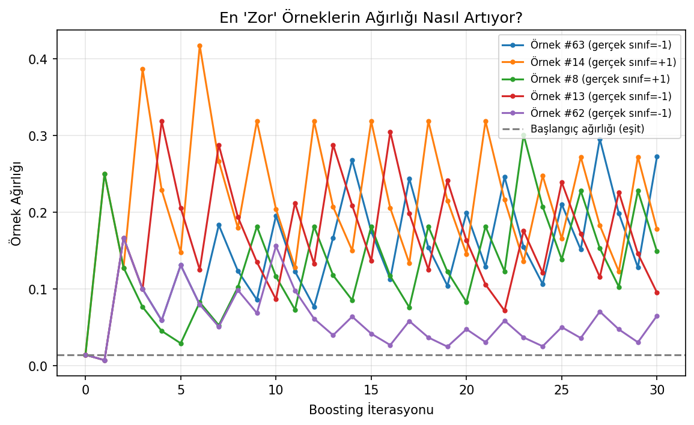
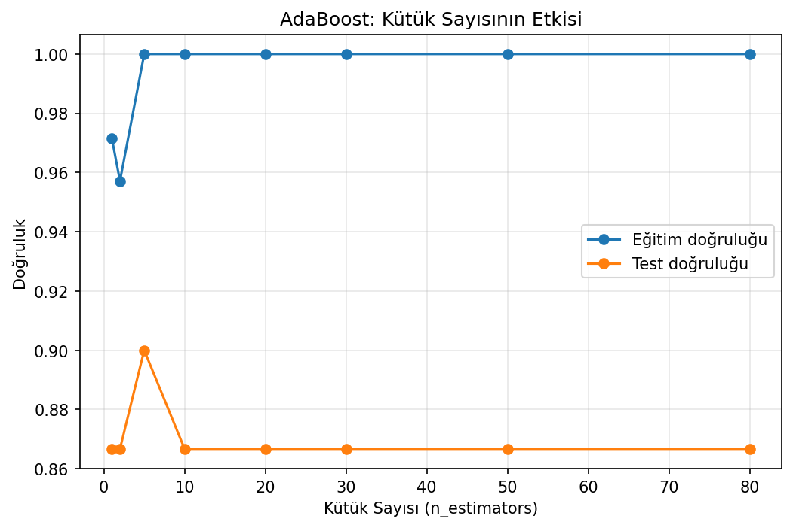

# Iris İkili Sınıflandırması - AdaBoost

Karar kütüklerini ardışık biçimde birleştiren AdaBoost algoritmasının hem sıfırdan hem scikit-learn ile uygulandığı sınıflandırma çalışması.

## Amaç

Boosting'in yalnızca hazır bir model çağrısı olmadığını göstermek; örnek ağırlıklarının yanlış sınıflandırılan gözlemlere nasıl aktarıldığını ve her zayıf öğrenicinin nihai karara hangi katsayıyla katıldığını görünür hale getirmek.

## Veri Seti

Yerel `data/iris.csv` kopyasındaki versicolor ve virginica sınıfları kullanılmıştır. Dört sayısal özellikten oluşan 100 gözlem, stratified olarak 70 eğitim ve 30 test örneğine ayrılmıştır.

## Yöntem

- Tek seviyeli karar kütüğü oluşturma
- Ağırlıklı hatadan öğrenici katsayısı hesaplama
- Yanlış örneklerin ağırlığını artırma
- 20 zayıf öğreniciyi ağırlıklı oylamayla birleştirme
- Sonucu scikit-learn `AdaBoostClassifier` ile doğrulama

## Sonuçlar

| Model | Test accuracy |
|---|---:|
| Sıfırdan AdaBoost | %86,7 |
| scikit-learn AdaBoost | %86,7 |

İki uygulamanın aynı test doğruluğuna ulaşması, sıfırdan yazılan ağırlık güncelleme ve oylama akışının referans uygulamayla tutarlı çalıştığını gösterir.

| Karar sınırı | Performans gelişimi |
|---|---|
|  |  |

## Çalıştırma

```bash
pip install -r requirements.txt
python adaboost.py
```

**Teknolojiler:** Python, NumPy, scikit-learn, Matplotlib
