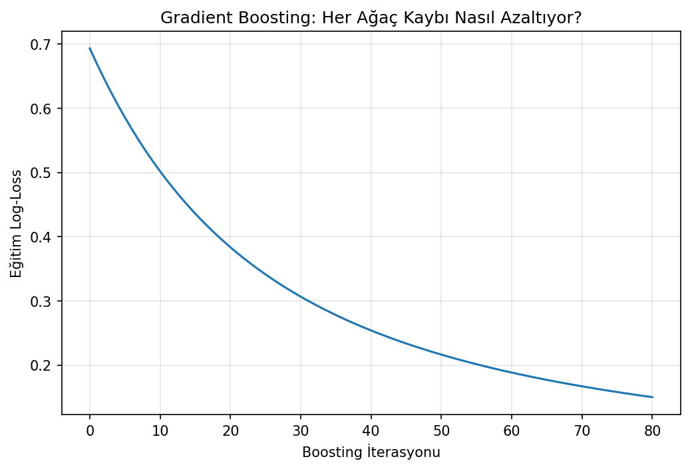
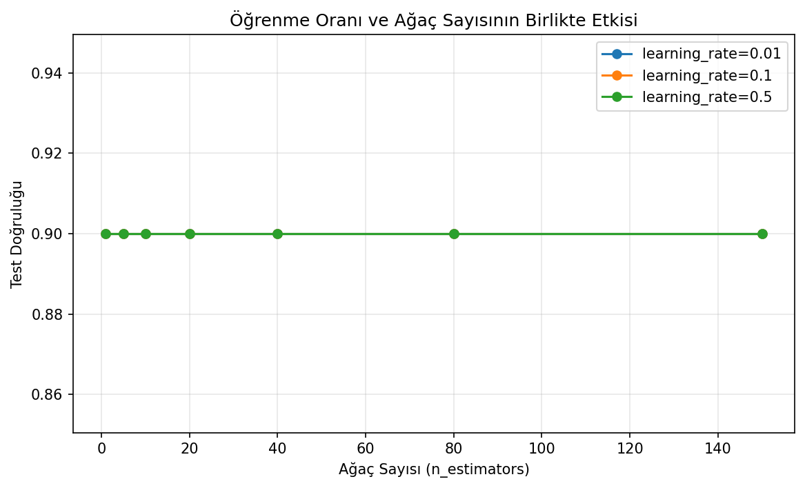
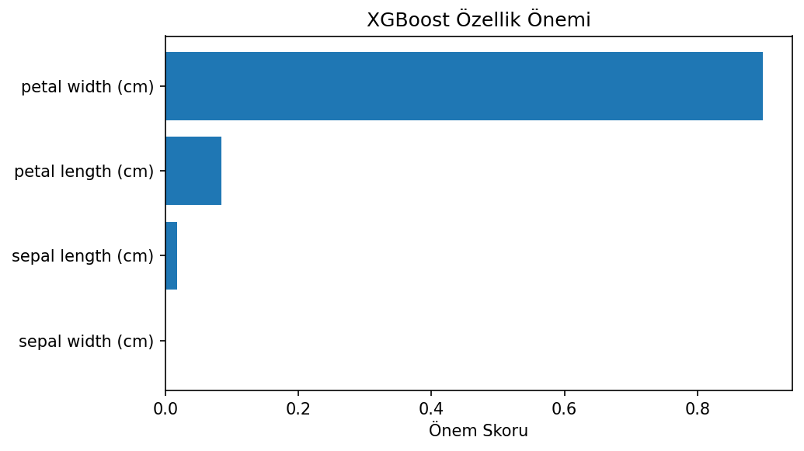

# Gradient Boosting ve XGBoost Karşılaştırması

Artıkların ardışık ağaçlarla düzeltilmesi fikrini sıfırdan kuran ve sonucu scikit-learn Gradient Boosting ile XGBoost'a karşı test eden ikili sınıflandırma çalışması.

## Amaç

Gradient Boosting'in temel mekanizmasını, yalnızca kütüphane çıktısı üzerinden değil her turdaki tahmin güncellemesi üzerinden göstermek. XGBoost aynı eğitim-test bölmesinde karşılaştırma modeli olarak kullanılmıştır.

## Veri Seti ve Tasarım

`data/iris.csv` içindeki versicolor ve virginica sınıflarından 100 gözlem kullanıldı. Dört özellikli veri 70 eğitim ve 30 test örneğine stratified olarak ayrıldı.

## Uygulama Akışı

1. Başlangıç log-odds tahmini oluşturma
2. Negatif gradyan/artıkları hesaplama
3. Küçük karar ağaçlarıyla düzeltme öğrenme
4. Öğrenme oranıyla tahmini güncelleme
5. Üç uygulamayı aynı test verisinde karşılaştırma

## Sonuçlar

| Model | Test accuracy |
|---|---:|
| Sıfırdan Gradient Boosting | %90,0 |
| scikit-learn Gradient Boosting | %86,7 |
| XGBoost | %90,0 |

30 gözlemlik test seti küçük olduğu için birkaç örnek sonuçları belirgin değiştirebilir. Bu nedenle tablo algoritmalar arasında kesin üstünlük iddiası değil, uygulamaların aynı problem üzerindeki davranış karşılaştırmasıdır.



| Özellik önemi | Eğitim süresi |
|---|---|
|  |  |

## Çalıştırma

```bash
pip install -r requirements.txt
python boosting_karsilastirma.py
```

**Teknolojiler:** Python, NumPy, scikit-learn, XGBoost, Matplotlib
