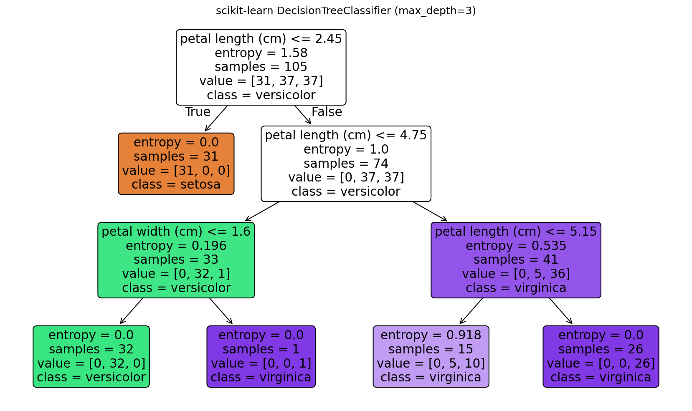
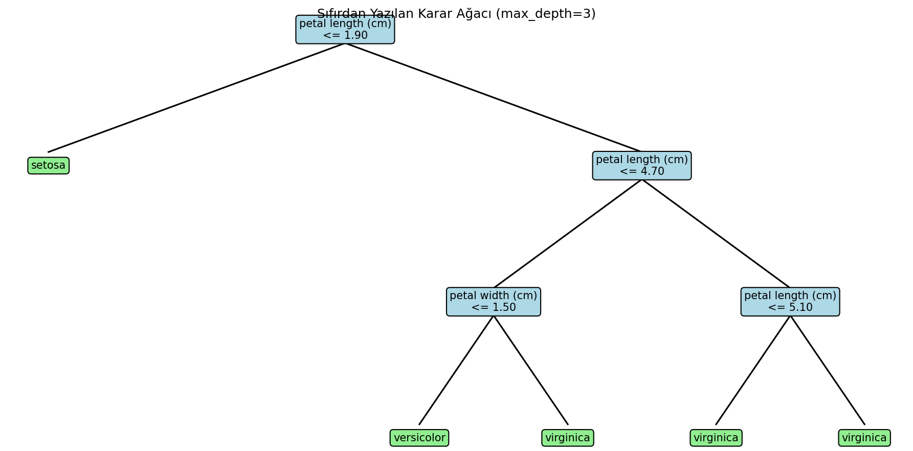
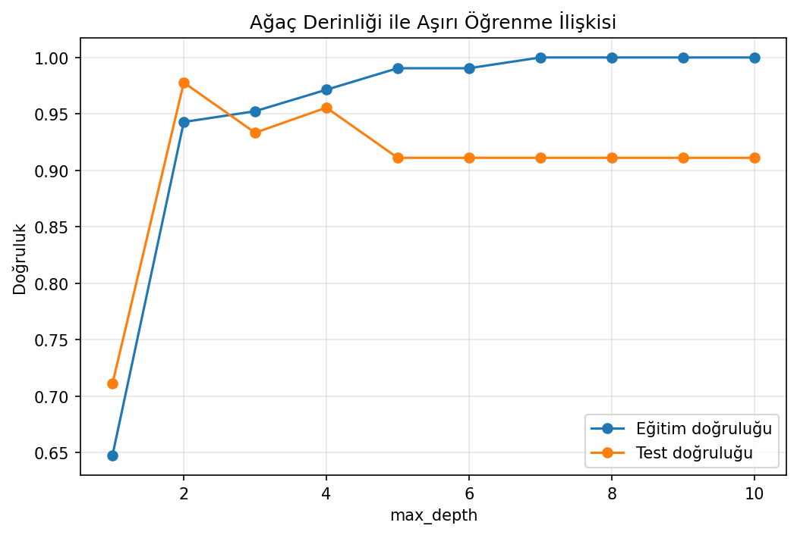

# Iris Sınıflandırması - Decision Tree

Entropy, Gini ve bilgi kazancını hesaplayarak karar ağacını sıfırdan kuran; derinlik kontrolünün model karmaşıklığına etkisini inceleyen sınıflandırma çalışması.

## Neden Decision Tree?

Karar ağaçları ölçekleme gerektirmeden sayısal eşikler üretir ve tahmin yolunu doğrudan açıklayabilir. Buna karşılık sınırsız derinlik küçük veri setlerinde aşırı öğrenmeye açıktır. Bu uygulama iki özelliği birlikte gösterir: yorumlanabilir kurallar ve derinlik kaynaklı varyans.

## Veri Seti

`data/iris.csv`, 150 çiçek için sepal/petal uzunluk ve genişliklerini ve üç tür etiketini içerir. Veri 105 eğitim ve 45 test gözlemine stratified olarak ayrılmıştır.

## Sonuçlar

| Model | Test accuracy |
|---|---:|
| Sıfırdan karar ağacı | %93,3 |
| scikit-learn karar ağacı | %97,8 |

İlk ve en belirleyici bölme `petal length <= 1.90` kuralıdır ve setosa sınıfını ayırır. Devam eden dallar ağırlıklı olarak petal uzunluğu ve genişliğini kullanır.

### Öğrenilen ağaç



### Karmaşıklık analizi

| Karar sınırı | Derinlik karşılaştırması |
|---|---|
|  |  |

## Çalıştırma

```bash
pip install -r requirements.txt
python karar_agaci.py
```

**Teknolojiler:** Python, NumPy, scikit-learn, Matplotlib
