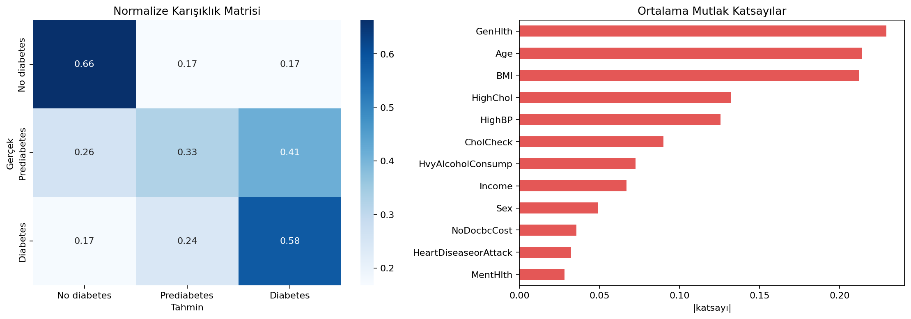

# Diyabet Sağlık Göstergeleri - Logistic Regression

Davranışsal ve sağlık göstergelerinden normal, prediyabet ve diyabet sınıflarını tahmin eden çok sınıflı Logistic Regression çalışması.

## Problem

Hedef değişken üç sınıftan oluşur ve sınıf dağılımı ciddi biçimde dengesizdir. Özellikle prediyabet gözlemleri toplam verinin yalnızca %1,83'ünü oluşturur. Bu nedenle yüksek accuracy tek başına yeterli değildir; macro-F1 ve one-vs-rest macro ROC-AUC öne çıkarılmıştır.

## Veri Seti

`data/diabetes_health_indicators.csv` dosyasında 253.680 gözlem ve 22 değişken bulunur. `Diabetes_012` hedefi 0=normal, 1=prediyabet ve 2=diyabet sınıflarını temsil eder. BMI, genel sağlık, fiziksel aktivite, yaş grubu, yüksek tansiyon ve kolesterol gibi göstergeler kullanılır.

## Model Akışı

- Stratified eğitim-test ayrımı
- Sayısal özellikleri eğitim verisine göre standartlaştırma
- Dengesiz sınıflar için dengeli sınıf ağırlıkları
- Çok sınıflı Logistic Regression
- Confusion matrix ve sınıf bazlı performans incelemesi

## Sonuçlar

| Metrik | Değer |
|---|---:|
| Accuracy | 0,646 |
| Macro F1 | 0,427 |
| Macro ROC-AUC | 0,773 |

ROC-AUC model skorlarının ayırt edici bilgi taşıdığını gösterirken düşük macro-F1, azınlık prediyabet sınıfının sabit karar eşiğinde yeterince ayrıştırılamadığını ortaya koyar. Sonuç güçlü bir üretim modeli değil, sınıf dengesizliğinin metrik seçimini nasıl değiştirdiğini gösteren bir deneydir.



## Çalıştırma

```bash
pip install -r requirements.txt
python diabetes_logistic_regression.py
```

**Teknolojiler:** Python, pandas, scikit-learn, Matplotlib, Seaborn
