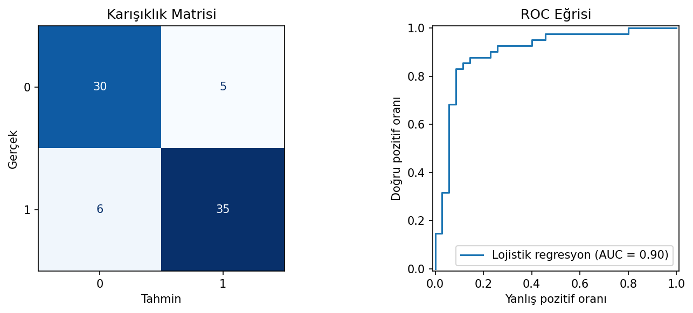

# Kalp Hastalığı Sınıflandırması - Logistic Regression

Klinik ölçümlerden kalp hastalığı bulunma olasılığını tahmin eden ve doğrusal sınıflandırmanın yorumlanabilirliğini gösteren çalışma.

## Amaç ve Model Tercihi

Logistic Regression sınıf olasılığı üretir ve katsayıların yönü üzerinden değişken etkilerinin incelenmesine imkân verir. Sağlık verisinde yalnızca accuracy'ye bakmak yetersiz olduğundan ROC-AUC, precision, recall ve F1 birlikte değerlendirilmiştir. Bu çalışma tanı sistemi değil, sınıflandırma yönteminin teknik uygulamasıdır.

## Veri Seti

`data/heart.csv` dosyasında 1.025 gözlem ve 14 sütun bulunur. Yaş, göğüs ağrısı türü, dinlenme tansiyonu, kolesterol, maksimum kalp hızı ve egzersize bağlı göstergeler model girdileridir; `target` ikili hedef değişkendir.

## Uygulama Akışı

1. Veri türü, eksik değer ve sınıf dağılımı kontrolü
2. Eğitim-test ayrımı
3. Sayısal özellikleri standartlaştırma
4. Logistic Regression modelini eğitme
5. Confusion matrix ve ROC eğrisiyle değerlendirme

## Sonuçlar

| Metrik | Değer |
|---|---:|
| Test accuracy | %85,5 |
| ROC-AUC | 0,903 |

ROC-AUC'nin accuracy'den daha güçlü görünmesi, model skorlarının sınıfları sıralamada başarılı olduğunu; fakat sabit 0,50 karar eşiğinde bazı hataların sürdüğünü gösterir. Sağlık senaryosunda yanlış negatif maliyeti yüksekse eşik recall lehine yeniden seçilmelidir.



## Çalıştırma

```bash
pip install -r requirements.txt
python logistic_regresyon.py
```

**Teknolojiler:** Python, pandas, scikit-learn, Matplotlib, Seaborn
