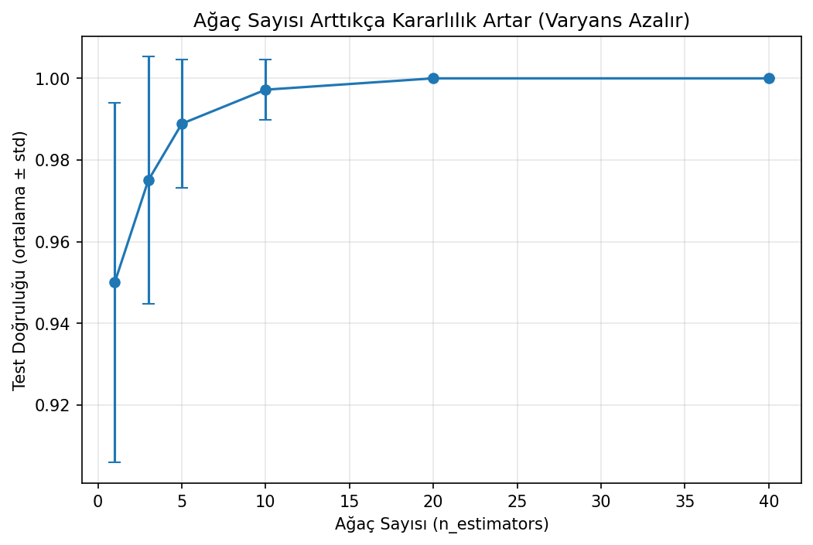
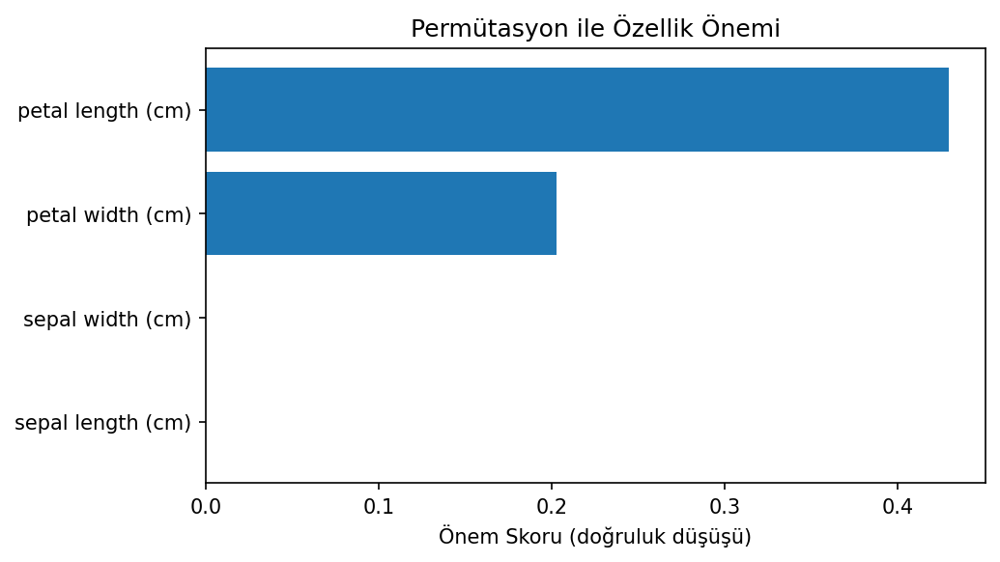

# Iris Sınıflandırması - Random Forest

Bootstrap örnekleme ve rastgele özellik alt kümelerini kullanarak Random Forest algoritmasını sıfırdan kuran, ardından scikit-learn uygulamasıyla karşılaştıran çalışma.

## Amaç ve Model Tercihi

Tek bir karar ağacı verideki küçük değişimlere duyarlı olabilir. Random Forest farklı bootstrap örnekleriyle eğitilmiş ağaçları çoğunluk oylamasıyla birleştirerek bu varyansı azaltır. Uygulamada ağaç sayısının ortalama doğruluk ve standart sapma üzerindeki etkisi ayrıca ölçülmüştür.

## Veri Seti

`data/iris.csv` dosyasındaki 150 gözlem ve dört sayısal özellik kullanıldı. Stratified ayrım sonucunda 105 eğitim ve 45 test gözlemi elde edildi.

## Sonuçlar

| Model | Test accuracy |
|---|---:|
| Tek karar ağacı | %95,6 |
| Sıfırdan Random Forest | %100,0 |
| scikit-learn Random Forest | %100,0 |
| Out-of-bag accuracy | %92,4 |

Ağaç sayısı 1'den 20'ye çıktığında tekrarlar arasındaki doğruluk standart sapması 0,044'ten 0'a gerilemiştir. Küçük ve kolay ayrılabilen Iris verisi nedeniyle %100 sonuç genelleştirilebilir bir sektör performansı olarak yorumlanmamalıdır.

| Ağaç sayısı etkisi | Özellik önemleri |
|---|---|
|  |  |

## Çalıştırma

```bash
pip install -r requirements.txt
python random_forest.py
```

**Teknolojiler:** Python, NumPy, scikit-learn, Matplotlib
