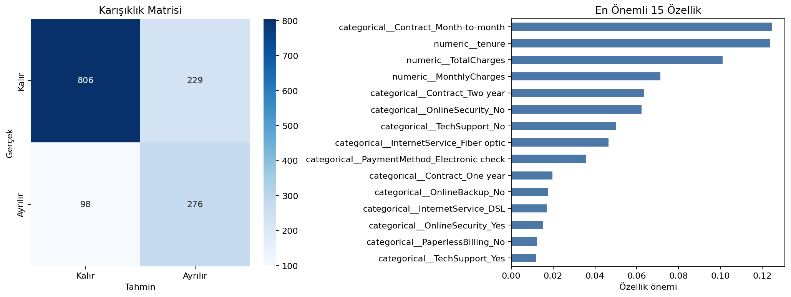

# Telco Müşteri Kaybı - Random Forest

Abonelik, sözleşme, hizmet ve ücret bilgilerini kullanarak bir müşterinin hizmeti bırakıp bırakmayacağını tahmin eden ikili sınıflandırma çalışması.

## Problem ve Model Tercihi

Müşteri kaybı verisi hem sayısal hem kategorik çok sayıda özellik içerir. Random Forest doğrusal olmayan ilişkileri ve özellik etkileşimlerini yakalayabildiği, ayrıca sınıf ağırlığı ve özellik önemi sunduğu için kullanıldı. Modelin amacı yalnızca yüksek accuracy üretmek değil, kayıp riski taşıyan müşterileri ayırt edebilmektir.

## Veri Seti

`data/telco_customer_churn.csv` dosyasında 7.043 müşteri ve 21 değişken bulunur. `Churn` hedefi müşterinin hizmetten ayrılma durumunu gösterir.

| Değişken grubu | Örnekler |
|---|---|
| Müşteri profili | `gender`, `SeniorCitizen`, `Partner` |
| Hizmetler | `InternetService`, `OnlineSecurity`, `TechSupport` |
| Sözleşme | `Contract`, `PaperlessBilling`, `PaymentMethod` |
| Finansal | `MonthlyCharges`, `TotalCharges` |

## Model Akışı

- `TotalCharges` alanını sayısala çevirme ve eksikleri medyanla tamamlama
- Kategorik sütunlarda one-hot encoding
- Sayısal ve kategorik dönüşümleri `ColumnTransformer` içinde birleştirme
- `class_weight="balanced"` ile sınıf dengesizliğini ele alma
- Stratified eğitim-test ayrımı

## Sonuçlar

| Metrik | Değer |
|---|---:|
| Accuracy | 0,768 |
| Macro F1 | 0,730 |
| ROC-AUC | 0,841 |

ROC-AUC değeri modelin iki sınıfı sıralama gücünün makul olduğunu gösterirken, accuracy tek başına operasyonel başarı kanıtı değildir. Gerçek kullanımda karar eşiği müşteri tutundurma maliyetine göre ayrıca ayarlanmalıdır.



## Çalıştırma

```bash
pip install -r requirements.txt
python telco_random_forest.py
```

**Teknolojiler:** Python, pandas, scikit-learn, Matplotlib, Seaborn
