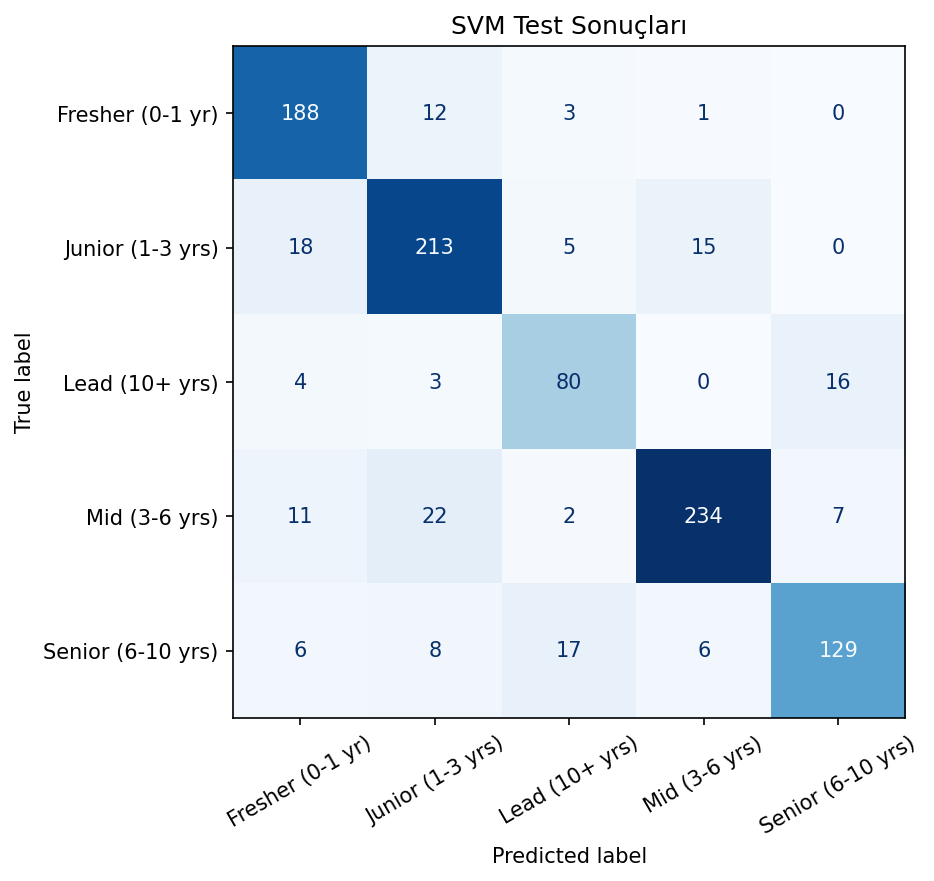

# İş İlanı Deneyim Seviyesi - Support Vector Machine

İş ilanı özelliklerinden pozisyonun deneyim seviyesini tahmin eden çok sınıflı Support Vector Machine çalışması.

## Neden SVM?

SVM, sınıflar arasındaki marjı büyüten karar sınırını arar ve kernel yaklaşımıyla doğrusal olmayan ayrımları temsil edebilir. Model mesafeye dayalı olduğu için sayısal özelliklerin ölçeklenmesi zorunlu tutulmuş; `C`, `gamma` ve kernel seçenekleri karşılaştırılmıştır.

## Veri Seti

`data/india_job_market.csv` dosyasında 5.000 iş ilanı ve 17 değişken bulunur. Rol, sektör, maaş, konum, beceri ve deneyim bilgileri işlenerek hedef deneyim seviyesi modellenir.

## Uygulama Akışı

- Eksik ve kategorik alanları hazırlama
- Kategorik değişkenleri kodlama
- Sayısal değişkenleri standartlaştırma
- Farklı SVM yapılarını karşılaştırma
- Macro-F1 ve confusion matrix ile sınıf bazlı kontrol

## Sonuçlar

| Metrik | Değer |
|---|---:|
| Test accuracy | %84,4 |
| Macro F1 | 0,832 |

Macro-F1'in accuracy'ye yakın olması, performansın yalnızca baskın sınıftan kaynaklanmadığını gösterir. Bununla birlikte sonuç veri setindeki temsil ve etiket kalitesiyle sınırlıdır.



## Çalıştırma

```bash
pip install -r requirements.txt
python svm_siniflandirma.py
```

**Teknolojiler:** Python, pandas, scikit-learn, Matplotlib, Seaborn
