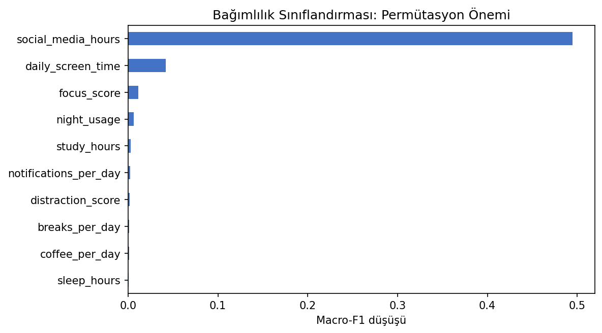

# Öğrenci Üretkenliği ve Bağımlılık Seviyesi - Random Forest

Aynı öğrenci davranış verisi üzerinde bir sayısal hedefi tahmin eden regresyon ve bir kategori tahmin eden sınıflandırma akışlarını birlikte ele alan çalışma.

## Problem Tasarımı

Bu klasör tek bir hedef türüne ait değildir. `Productivity_Score` sayısal olduğu için Random Forest Regressor; bağımlılık seviyesi kategorik olduğu için Random Forest Classifier kullanılır. Bu nedenle çalışma Regression veya Classification klasörlerinden birine zorla yerleştirilmemiş, `Mixed-Tasks` altında tutulmuştur.

## Veri Seti

`data/student.csv` dosyasında 10.000 gözlem ve 13 değişken bulunur. Günlük ekran süresi, uyku, fiziksel aktivite, sosyal medya kullanımı ve üretkenlik göstergeleri model girdileridir.

## Sonuçlar

| Görev | Metrik | Değer |
|---|---|---:|
| Üretkenlik regresyonu | Ortalama R² | 0,816 |
| Üretkenlik regresyonu | MAE | 9,186 |
| Bağımlılık sınıflandırması | Macro F1 | 0,930 |

Regresyon sonucu modelin üretkenlik puanındaki varyansın önemli bir bölümünü yakaladığını gösterir. Sınıflandırmadaki yüksek skor veri içindeki bağımlılık etiketinin giriş özelliklerinden güçlü biçimde türetildiğini düşündürür; veri üretim mantığı veya olası hedef sızıntısı ayrıca kontrol edilmelidir.



## Çalıştırma

```bash
pip install -r requirements.txt
python ogrenci_random_forest.py
```

**Teknolojiler:** Python, pandas, scikit-learn, Matplotlib, Seaborn
