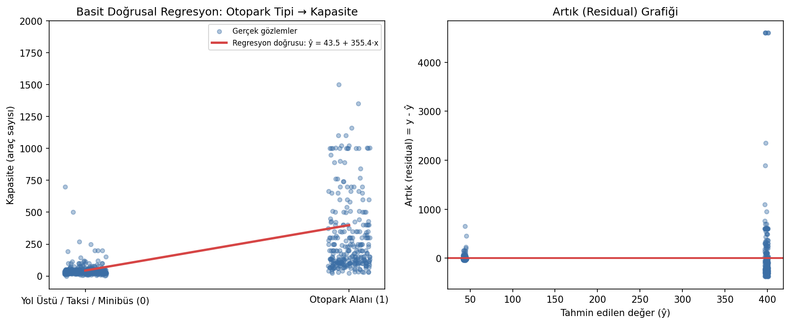

# İSPARK Otopark Kapasitesi - Linear Regression

Otopark türü ile araç kapasitesi arasındaki ilişkiyi doğrusal regresyonla ölçen ve model katsayısını iş bağlamında yorumlayan çalışma.

## Problem

Hedef değişken `Capacity` sayısaldır. Temel soru, açık otopark ve otopark alanı gibi tesis türlerinin kapasite üzerinde açıklanabilir bir fark oluşturup oluşturmadığıdır. Bu nedenle çalışma supervised learning altında bir regresyon problemidir ve ilk model olarak yorumlanabilir Linear Regression kullanılmıştır.

## Veri Seti

`data/ispark_parking.csv` dosyasında 708 otopark kaydı ve 9 değişken bulunur. Otopark adı, türü, konumu, koordinatları, çalışma saatleri ve kapasite alanları yer alır.

## Uygulama Akışı

- Veri tiplerini ve eksik değerleri kontrol etme
- Otopark türlerini inceleme ve modele uygun biçimde kodlama
- Eğitim-test ayrımı
- Linear Regression modelini eğitme
- Katsayı, tahmin hatası ve R² üzerinden yorumlama

## Sonuçlar

| Bulgular | Değer |
|---|---:|
| Otopark alanı türünün kapasite farkı | yaklaşık +355 araç |
| Açıklanan varyans | R² ≈ 0,13 |

Pozitif katsayı, otopark alanlarının referans türe göre daha yüksek kapasiteye sahip olduğunu gösterir. Ancak R²'nin düşük olması, kapasitenin yalnızca tesis türüyle açıklanamayacağını ortaya koyar. İlçe, merkezi konum, fiziksel alan ve kat sayısı gibi ek değişkenler olmadan modelin tahmin gücü sınırlıdır.



## Çalıştırma

```bash
pip install -r requirements.txt
python ispark_regresyon.py
```

**Teknolojiler:** Python, pandas, scikit-learn, Matplotlib, Seaborn
