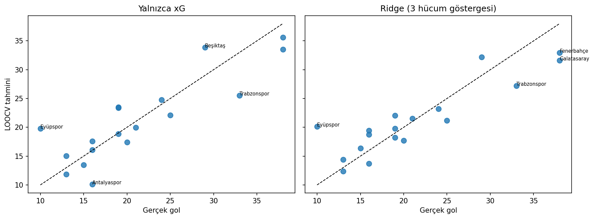

# Süper Lig Gol Tahmini - Linear ve Ridge Regression

Takım bazlı hücum istatistiklerinden sezon gol sayısını tahmin eden ve küçük örneklemde doğrusal model ile Ridge regularizasyonunu karşılaştıran çalışma.

## Neden Ridge?

Futbol istatistiklerinde şut, isabetli şut, xG ve hücum aksiyonu gibi özellikler birbirleriyle yüksek ilişkili olabilir. Bu çoklu doğrusal bağlantı katsayıları kararsızlaştırır. Ridge, katsayılara L2 cezası ekleyerek küçük veri setinde daha kontrollü bir model kurmayı amaçlar.

## Veri Seti

`data/superlig_proje.xlsx` dosyasında 18 takım ve 21 değişken bulunur. Örneklem çok küçük olduğu için tek bir rastgele test bölmesi yerine leave-one-out cross-validation kullanılmıştır.

## Sonuçlar

| Model | LOOCV R² | MAE |
|---|---:|---:|
| Doğrusal/xG modeli | 0,744 | 3,20 gol |
| Ridge Regression | 0,769 | 3,03 gol |

Ridge hem açıklanan varyansı artırmış hem ortalama mutlak hatayı azaltmıştır. Fark sınırlıdır; yalnızca 18 takım bulunduğu için sonuç farklı sezonlarda tekrar doğrulanmadan genellenmemelidir.



## Çalıştırma

```bash
pip install -r requirements.txt
python superlig_regresyon.py
```

**Teknolojiler:** Python, pandas, scikit-learn, openpyxl, Matplotlib
