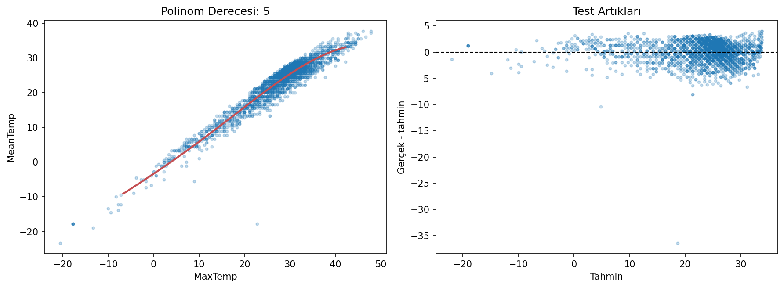

# Hava Sıcaklığı Tahmini - Polynomial Regression

Günlük meteorolojik ölçümler arasındaki doğrusal olmayan ilişkiyi polinom özellikleriyle modelleyen sıcaklık tahmin çalışması.

## Problem ve Model Tercihi

Hedef sıcaklık sayısal olduğu için problem regresyondur. Atmosferik değişkenler arasındaki ilişki yalnızca düz bir doğruyla temsil edilemeyeceğinden, girdilerin üs ve etkileşim terimleri oluşturularak Polynomial Regression uygulanmıştır.

## Veri Setleri

| Dosya | İçerik |
|---|---|
| `data/weather_summary.csv` | 119.040 günlük hava gözlemi, 31 sütun |
| `data/weather_station_locations.csv` | 161 istasyonun konum bilgileri |

Ana model günlük hava gözlemlerini kullanır; istasyon dosyası mekânsal bağlamı korumak için aynı proje altında tutulur.

## Uygulama Akışı

- Eksik ve sayısal olmayan değerleri kontrol etme
- İlgili meteorolojik özellikleri seçme
- Farklı polinom derecelerini karşılaştırma
- Eğitim ve test hatalarını birlikte inceleme
- RMSE ve R² ile final modeli değerlendirme

## Sonuçlar

| Metrik | 5. derece model |
|---|---:|
| Test R² | 0,921 |
| Test RMSE | 2,007 °C |

Beşinci derece model güçlü uyum üretmiştir; ancak yüksek polinom derecesi özellik sayısını ve aşırı öğrenme riskini hızla artırır. Sonuç yalnızca test bölmesinde değerlendirilmiş, daha karmaşık model otomatik olarak daha iyi kabul edilmemiştir.



## Çalıştırma

```bash
pip install -r requirements.txt
python polinom_regresyon.py
```

**Teknolojiler:** Python, pandas, NumPy, scikit-learn, Matplotlib
