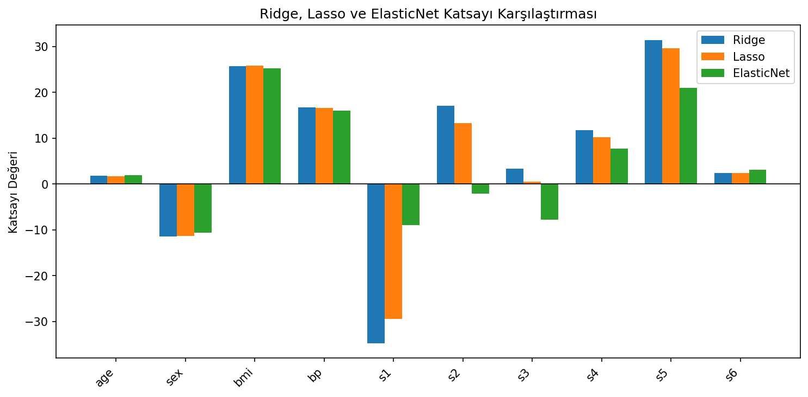

# Diyabet İlerleme Tahmini - Ridge, Lasso ve Elastic Net

On standartlaştırılmış sağlık göstergesinden bir yıllık hastalık ilerleme skorunu tahmin eden regularized regression karşılaştırması.

## Amaç

L1 ve L2 cezalarının aynı veri üzerindeki katsayı ve tahmin davranışını karşılaştırmak. Ridge katsayıları küçültür, Lasso bazı katsayıları sıfıra yaklaştırarak özellik seçimi etkisi yaratabilir, Elastic Net ise iki cezayı birlikte kullanır.

## Veri Seti

`data/diabetes_regression.csv` dosyasında 442 gözlem, 10 sayısal özellik ve bir sürekli hedef bulunur. Veri 353 eğitim ve 89 test gözlemine ayrılmıştır.

## Sonuçlar

| Model | Test R² | MSE | Seçilen ayar |
|---|---:|---:|---|
| Ridge | 0,4572 | 2.875,78 | alpha=10 |
| Lasso | 0,4669 | 2.824,57 | alpha=1 |
| Elastic Net | 0,4600 | 2.860,95 | alpha=0,1; l1_ratio=0,1 |

Bu bölmede en iyi R² ve en düşük MSE Lasso'da elde edilmiştir. Ancak farklar küçüktür ve Lasso 10 özelliğin hiçbirini tamamen sıfırlamamıştır; bu veri ve alpha aralığında belirgin bir özellik eleme etkisi oluşmamıştır.



## Çalıştırma

```bash
pip install -r requirements.txt
python regularizasyon.py
```

**Teknolojiler:** Python, pandas, scikit-learn, Matplotlib
