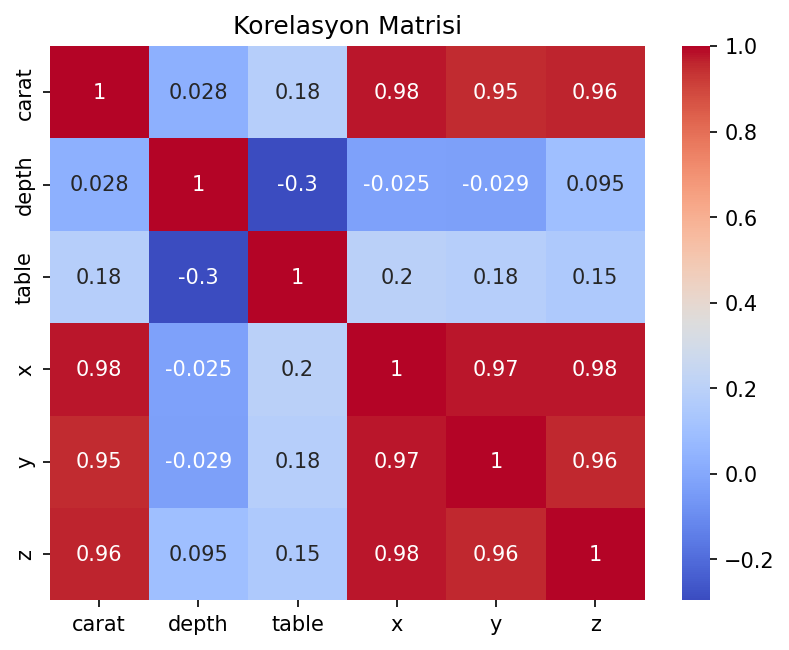

# Elmas Fiyat Tahmini - Regularized Regression

Elmasın fiziksel ölçümleri ve kalite sınıflarından fiyat tahmini yapan Ridge, Lasso ve Elastic Net karşılaştırması.

## Veri Seti

`data/diamonds.csv` dosyası 53.940 gözlem ve 10 değişken içerir. `carat`, `depth`, `table`, `x`, `y`, `z` sayısal; `cut`, `color` ve `clarity` kategorik girdilerdir. Sıfır fiziksel ölçüler temizlendikten sonra kategorik özellikler kodlanmış ve sayısal özellikler ölçeklenmiştir.

## Neden Regularizasyon?

Karat ve fiziksel boyutlar birbirleriyle güçlü ilişkili olduğundan doğrusal katsayılar kararsızlaşabilir. Ridge ve Elastic Net bu katsayıları sınırlar; Lasso ise uygun ceza düzeyinde daha seyrek bir model üretebilir.

## Sonuçlar

| Model | Test R² | MAE | MSE |
|---|---:|---:|---:|
| Ridge | 0,9209 | 718,64 | 1.267.898,77 |
| Lasso | 0,9211 | 721,24 | 1.265.545,08 |
| Elastic Net | 0,8109 | 1.146,12 | 3.031.763,11 |

Ridge ve Lasso birbirine çok yakın sonuç üretmiştir. Elastic Net bu hiperparametre uzayında belirgin biçimde geride kalmıştır. Sonuç, regularizasyon türünün isim üzerinden değil doğrulama performansıyla seçilmesi gerektiğini gösterir.



## Çalıştırma

```bash
pip install -r requirements.txt
python elmas_fiyat_modeli.py
```

**Teknolojiler:** Python, pandas, scikit-learn, Matplotlib, Seaborn
