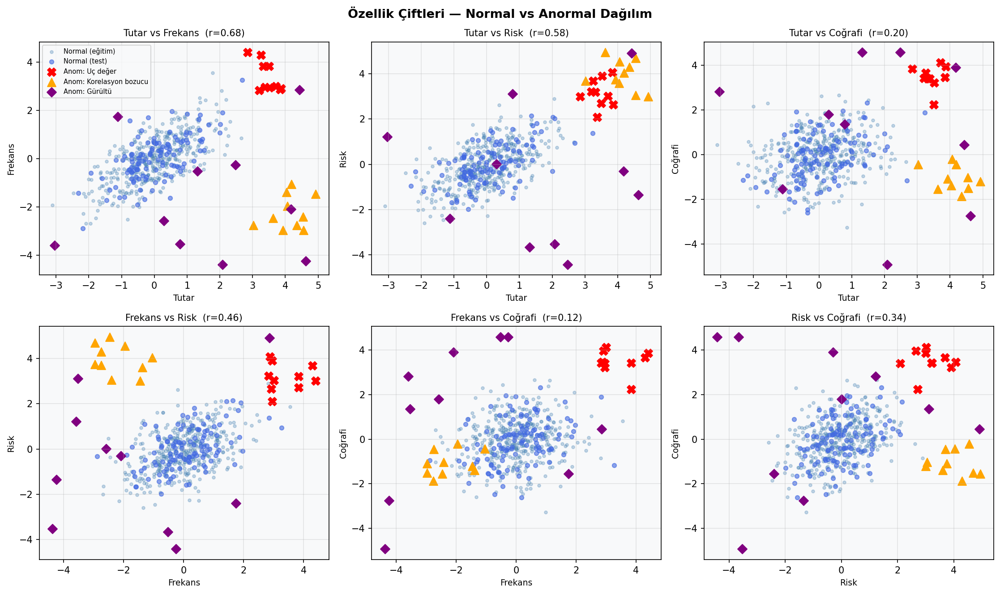
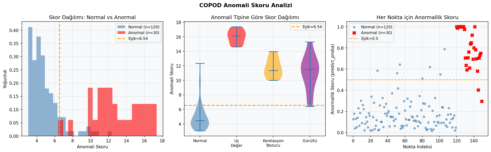
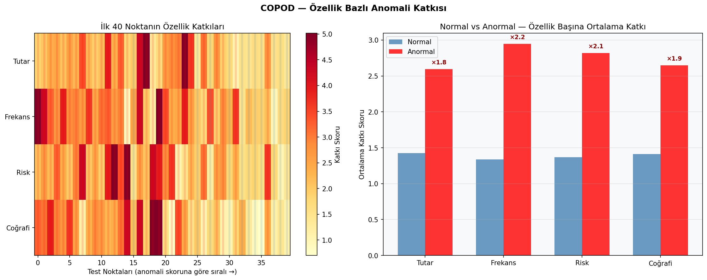
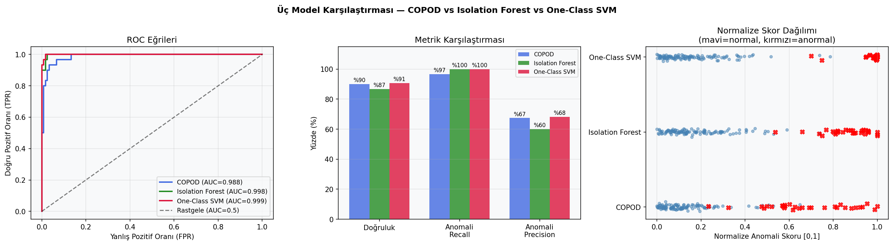

# COPOD ile Çok Değişkenli Anomali Tespiti

COPOD (Copula-Based Outlier Detection) kullanarak çok değişkenli gözlemleri olasılık kuyruklarına göre skorlayan ve her özelliğin anomali kararına katkısını inceleyen çalışma.

## Problem ve yöntem seçimi

Amaç, etiket bilgisi model eğitiminde kullanılmadan normal örüntüden ayrılan gözlemleri belirlemektir. COPOD; dağılım biçimi için parametrik bir varsayım gerektirmemesi, çok değişkenli veride çalışması ve özellik bazında açıklanabilir skorlar üretmesi nedeniyle seçildi.

## Veri seti

Sabit rastgelelik tohumu ile oluşturulan veri; 500 normal, 30 anormal gözlem ve dört sayısal özellik içerir. `is_anomaly` sütunu yalnızca sonuçları değerlendirmek için kullanılır.

| Dosya | Boyut | Rol |
|---|---:|---|
| `data/synthetic_copod_data.csv` | 530 satır × 5 sütun | Model girdisi ve değerlendirme etiketi |

## Analiz akışı

1. Özellik çiftlerinin dağılımlarını inceleme
2. COPOD ile karar skoru ve tahmin üretme
3. Özellik katkılarını karşılaştırma
4. Tahminleri gerçek etiketlerle değerlendirme
5. Alternatif anomali yöntemleriyle sonuç karşılaştırması

## Sonuçlar

| Ölçüt | Sonuç |
|---|---:|
| Doğruluk | %90,0 |
| Anomali precision | %67,4 |
| Anomali recall | %96,7 |
| ROC-AUC | 0,9875 |

Yüksek recall, anomalilerin büyük bölümünün yakalandığını gösterir. Precision değerinin daha düşük olması ise bazı normal gözlemlerin de anomali olarak işaretlendiğini gösterir. Operasyonel kullanımda eşik, kaçırma ve yanlış alarm maliyetlerine göre ayarlanmalıdır.

## Görseller

| Anomali skorları | Özellik katkıları |
|---|---|
|  |  |

| Özellik çiftleri | Model karşılaştırması |
|---|---|
|  |  |

## Çalıştırma

```bash
pip install -r requirements.txt
python copod.py
```

Grafikler `figures/` klasörüne yeniden yazılır.

## Teknolojiler

Python, pandas, NumPy, Matplotlib, Seaborn, scikit-learn ve PyOD.
