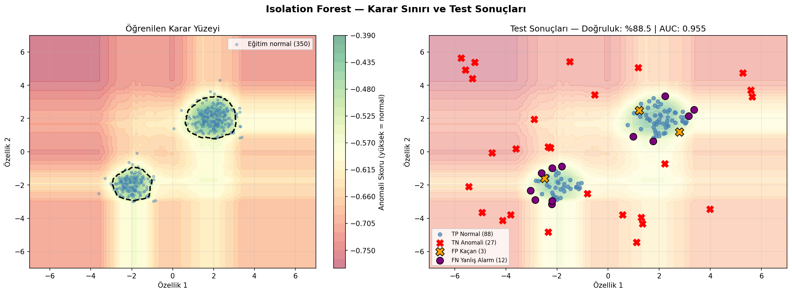
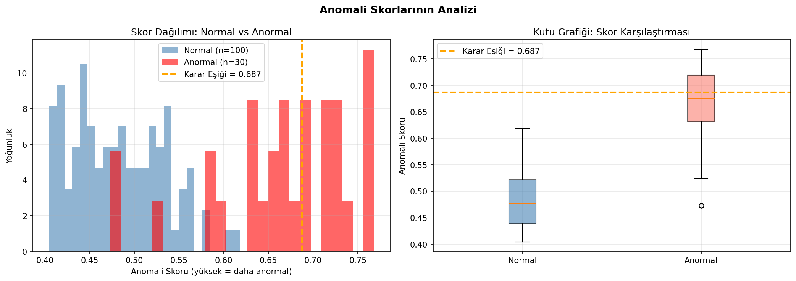
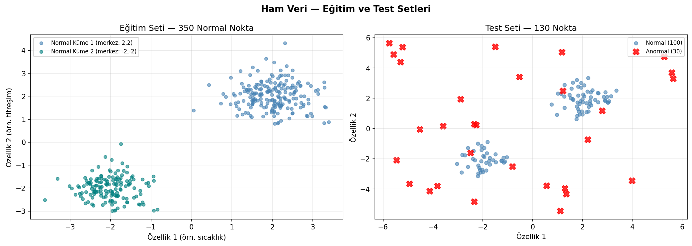
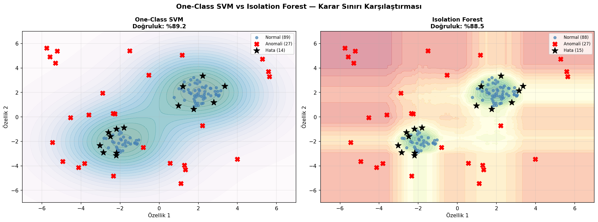

# Isolation Forest ile Anomali Tespiti

Normal gözlemlerden ayrışan noktaları rastgele bölmelerle izole eden Isolation Forest algoritmasının karar yüzeyi, anomali skoru ve sınıflandırma performansını inceleyen çalışma.

## Problem ve yöntem seçimi

Isolation Forest, anomalilerin az sayıda bölme ile diğer gözlemlerden ayrılacağı varsayımına dayanır. Yoğunluk tahmini gerektirmemesi ve yüksek boyutlu veriye ölçeklenebilmesi, algoritmayı genel amaçlı anomali taraması için uygun hale getirir.

## Veri seti

İki normal küme ile kontrollü biçimde eklenen aykırı gözlemlerden oluşan sentetik veri kullanılır. Gerçek etiket model eğitimine verilmez; yalnızca değerlendirme aşamasında kullanılır.

| Dosya | Boyut | Değişkenler |
|---|---:|---|
| `data/synthetic_anomaly_data.csv` | 380 satır × 3 sütun | `feature_1`, `feature_2`, `is_anomaly` |

## Analiz akışı

1. Normal ve anormal gözlemleri görsel olarak inceleme
2. Isolation Forest modelini sabit tohumla eğitme
3. Karar skorlarının dağılımını analiz etme
4. Karar yüzeyini çizme
5. Tahminleri etiketlerle karşılaştırma

## Sonuçlar

| Ölçüt | Sonuç |
|---|---:|
| Doğruluk | %88,5 |
| Anomali precision | %90,0 |
| Anomali recall | %69,2 |
| ROC-AUC | 0,9547 |

Modelin precision değeri yüksek; işaretlediği anomalilerin büyük bölümü gerçekten anomalidir. Recall daha düşük olduğu için bazı aykırı gözlemler kaçırılmıştır. `contamination` ve karar eşiği bu dengeyi doğrudan etkiler.

## Görseller

| Karar yüzeyi | Skor dağılımı |
|---|---|
|  |  |

| Ham veri | Model karşılaştırması |
|---|---|
|  |  |

## Çalıştırma

```bash
pip install -r requirements.txt
python isolation_forest.py
```

## Teknolojiler

Python, pandas, NumPy, Matplotlib, Seaborn ve scikit-learn.
