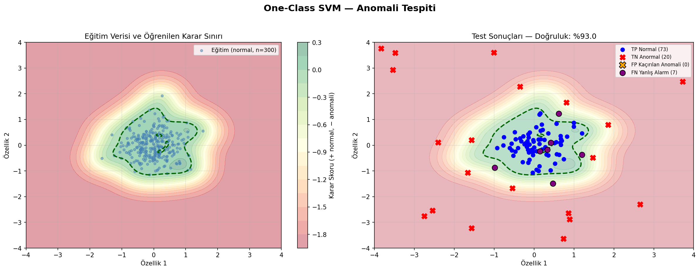
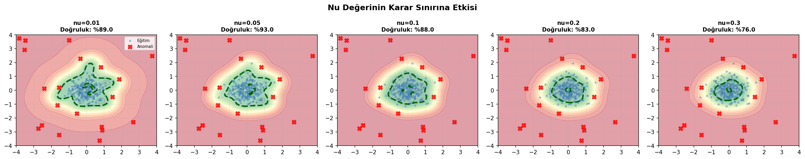

# One-Class SVM ile Anomali Tespiti

Normal gözlemleri çevreleyen esnek bir karar sınırı öğrenerek aykırı noktaları belirleyen One-Class SVM uygulaması.

## Problem ve yöntem seçimi

One-Class SVM, yalnızca normal örneklerden bir sınır öğrenebildiği için pozitif sınıfın az olduğu veya etiketlemenin zor olduğu senaryolarda kullanışlıdır. RBF çekirdeği doğrusal olmayan veri geometrisini yakalamak için seçildi.

## Veri seti

Model, normal gözlemler üzerinde eğitilir; ayrı test bölümüne normal ve anormal örnekler birlikte verilir.

| Dosya | Boyut | Değişkenler |
|---|---:|---|
| `data/synthetic_anomaly_data.csv` | 320 satır × 3 sütun | İki sayısal özellik ve değerlendirme etiketi |

## Analiz akışı

1. Özellikleri standartlaştırma
2. RBF çekirdekli One-Class SVM eğitme
3. `nu` parametresinin karar sınırına etkisini karşılaştırma
4. Test gözlemlerini normal/anormal olarak sınıflandırma

## Sonuçlar

| Ölçüt | Sonuç |
|---|---:|
| Doğruluk | %93,0 |
| Yakalanan anomaliler | 20 / 20 |

Tüm anomaliler yakalanırken bazı normal gözlemler sınır dışında kalmıştır. `nu`, beklenen aykırı oranına ilişkin üst sınırı ve destek vektörü sayısını birlikte etkilediğinden veri bağlamına göre seçilmelidir.

## Görseller

| Karar sınırı ve tahminler | `nu` karşılaştırması |
|---|---|
|  |  |

## Çalıştırma

```bash
pip install -r requirements.txt
python one_class_svm.py
```

## Teknolojiler

Python, pandas, NumPy, Matplotlib ve scikit-learn.
