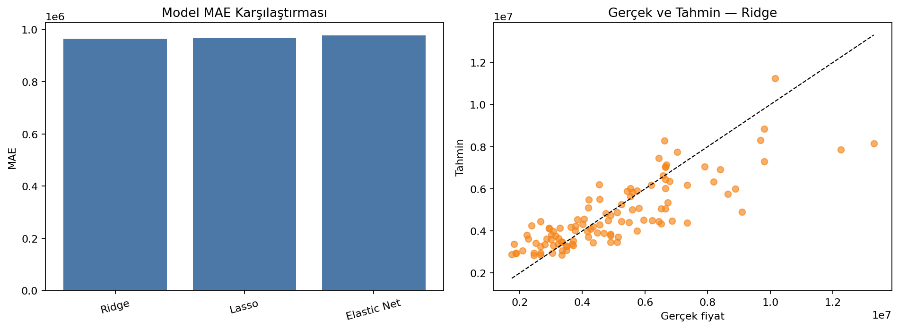
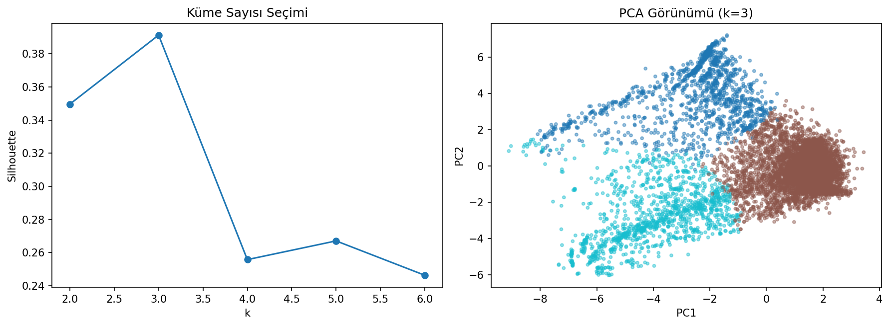
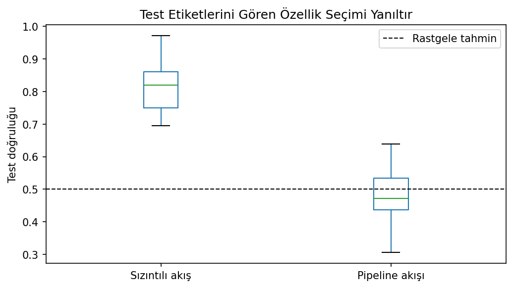

# SoftITo Data Analytics

Python programlama temellerinden keşifsel veri analizine; makine öğrenmesinden zaman serileri, görüntü işleme ve Power BI’a uzanan veri analitiği portföyü.

Bu depo yalnızca kod arşivi değildir. Her uygulama; çalıştırılabilir Python dosyası, kullandığı veri, bağımlılıklar, yöntem açıklaması, ölçülebilir sonuçlar ve üretilmiş görsellerle birlikte sunulur.

## İçerik haritası

| Alan | İçerik |
|---|---|
| [Programming Fundamentals](Programming-Fundamentals/) | Python, NumPy ve Pandas temelleri |
| [Data Analysis](Data-Analysis/) | EDA iş akışları ve veri görselleştirme |
| [Machine Learning](Machine-Learning/) | Supervised, unsupervised, model validation ve deep learning |
| [Time Series](Time-Series/) | ARIMA/SARIMA ve boosting tabanlı tahmin |
| [Causal Inference](Causal-Inference/) | Tedavi etkisi ve karıştırıcı değişken analizi |
| [Computer Vision](Computer-Vision/) | Görüntü işleme, renk uzayları, nesne tespiti ve CNN |
| [Business Intelligence](Business-Intelligence/) | Power BI satış ve SaaS raporları |

## Öne çıkan çalışmalar

| Çalışma | Yaklaşım | Seçilmiş sonuç |
|---|---|---:|
| [Telco müşteri kaybı](Machine-Learning/Supervised-Learning/Classification/Random-Forest/Telco-Customer-Churn/) | Random Forest | ROC-AUC 0,841 |
| [Konut fiyat tahmini](Machine-Learning/Supervised-Learning/Regression/Regularized-Regression/Housing-Prices/) | Ridge, Lasso, Elastic Net | En iyi R² 0,653 |
| [Diyabet ilerleme tahmini](Machine-Learning/Supervised-Learning/Regression/Regularized-Regression/Diabetes-Progression/) | Regularized Regression | En iyi R² 0,467 |
| [Iris yapay sinir ağı](Machine-Learning/Deep-Learning/Artificial-Neural-Networks/Iris-Classification/) | TensorFlow ANN | Test doğruluğu %96,67 |
| [Müşteri segmentasyonu](Machine-Learning/Unsupervised-Learning/Clustering/K-Means/Customer-Segmentation/) | K-Means | En iyi `k=3`, silhouette 0,391 |
| [COPOD anomali tespiti](Machine-Learning/Unsupervised-Learning/Anomaly-Detection/COPOD/) | Copula tabanlı skor | ROC-AUC 0,9875 |
| [ARIMA–SARIMA karşılaştırması](Time-Series/Statistical-Forecasting/ARIMA-and-SARIMA/) | İstatistiksel tahmin | SARIMA RMSE 12,84 |
| [Veri sızıntısı deneyi](Machine-Learning/Model-Validation/Data-Leakage/) | Pipeline karşılaştırması | %81,2 ve %48,3 |

| Telco müşteri kaybı | Konut fiyat tahmini |
|---|---|
|  |  |

| Müşteri segmentasyonu | Veri sızıntısı |
|---|---|
|  |  |

## Proje standardı

Her Python uygulaması aynı okunabilir yapıyı izler:

```text
Project/
├── README.md
├── analysis.py
├── requirements.txt
├── data/
└── figures/
```

- `README.md`: problem, yöntem, veri, sonuç ve yorum
- `.py`: doğrudan çalıştırılabilir temiz uygulama kodu
- `requirements.txt`: yalnızca ilgili uygulamanın bağımlılıkları
- `data/`: kullanılan yerel veri ve veri açıklaması
- `figures/`: kod tarafından üretilen, README içinde gösterilen çıktılar

Veri dosyalarının tamamı [Data Catalog](DATA-CATALOG.md) sayfasında listelenmiştir.

## Kurulum ve çalıştırma

Tek bir uygulamayı çalıştırmak için ilgili klasöre girin:

```bash
pip install -r requirements.txt
python <dosya_adi>.py
```

Tüm Python bağımlılıklarını tek ortamda kurmak için:

```bash
pip install -r requirements-all.txt
```

> CIFAR-10, açılmış hali yaklaşık 170 MB olduğu için depoya eklenmedi. İlgili CNN uygulaması veriyi ilk çalıştırmada Keras üzerinden indirir. Diğer uygulamaların girdileri yereldir.

## Depo özeti

- 38 çalıştırılabilir Python uygulaması
- 47 yerel veri dosyası
- 120’den fazla statik ve etkileşimli analiz çıktısı
- 2 düzenlenebilir Power BI raporu
- Proje bazında kurulum ve yeniden üretim adımları

Safari üzerinden yayınlamak için [GitHub yükleme rehberini](GITHUB-YUKLEME.md) izleyin.

## Planlanan eklemeler

- PostgreSQL veri tabanı ve sorgu çalışmaları
- Docker tabanlı makine öğrenmesi çalışma ortamı
