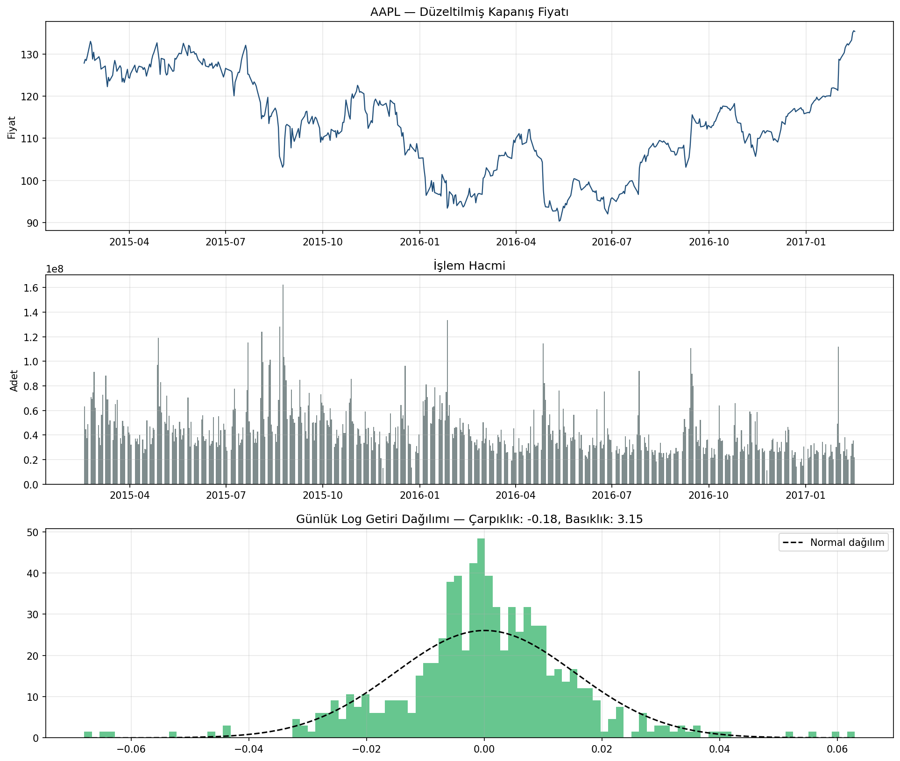
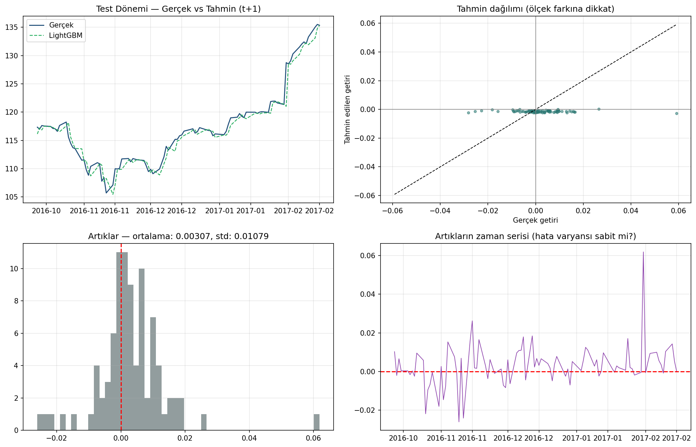
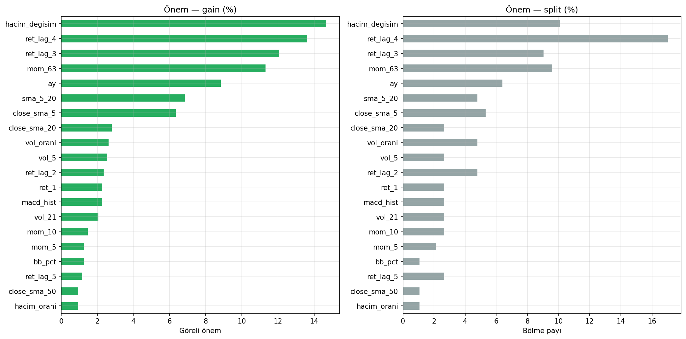
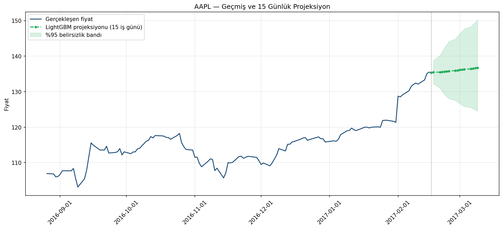

# AAPL Günlük Getiri Tahmini - LightGBM

AAPL fiyat ve hacim verilerinden teknik özellikler üreterek bir sonraki işlem gününün log getirisini tahmin eden zaman serisi çalışması.

## Amaç ve Değerlendirme Tasarımı

Finansal tahminde yüksek model karmaşıklığının otomatik olarak kullanılabilir sinyal üretmediğini test etmek amaçlandı. Veri rastgele bölünmedi; 266 eğitim, 88 doğrulama ve 88 test gözlemi kronolojik sırayla ayrıldı. Model ayrıca aylık yeniden eğitim kullanan walk-forward akışında değerlendirildi.

## Veri ve Özellikler

`data/aapl_prices.csv`, 17 Şubat 2015-16 Şubat 2017 arasındaki 506 günlük AAPL kaydını içerir. Fiyat getirileri, gecikmeler, momentum, hareketli ortalama oranları, volatilite, RSI, MACD, Bollinger konumu, hacim değişimi, hafta günü ve ay bilgisiyle 26 özellik üretildi.

## Modeller

- Sıfır getiri tahmin eden naif rastgele yürüyüş referansı
- Erken durdurmalı LightGBM
- TimeSeriesSplit ile optimize edilen LightGBM
- Aynı test döneminde XGBoost karşılaştırması

## Test Sonuçları

| Model | Getiri RMSE | R² | Yön doğruluğu |
|---|---:|---:|---:|
| Naif model | 0,01085 | -0,0259 | - |
| LightGBM | 0,01122 | -0,0977 | %45,45 |
| Optimize LightGBM | 0,01143 | -0,1383 | %43,18 |
| XGBoost | 0,01161 | -0,1753 | %46,59 |

LightGBM naif modeli geçemedi; RMSE yaklaşık %3,44 kötüleşti. Bu sonuç saklanmadı veya başarı gibi sunulmadı. Günlük fiyat yönü için bu özellik setinde güvenilir bir tahmin sinyali elde edilmemiştir.

### Fiyat, hacim ve getiri dağılımı



### Test dönemi hata analizi



### Özellik önemi ve ileri projeksiyon

| Özellik önemleri | 15 iş günü projeksiyonu |
|---|---|
|  |  |

## Çalıştırma

```bash
pip install -r requirements.txt
python lightgbm_hisse.py
```

**Not:** Bu çalışma yatırım tavsiyesi veya alım-satım sistemi değildir.
