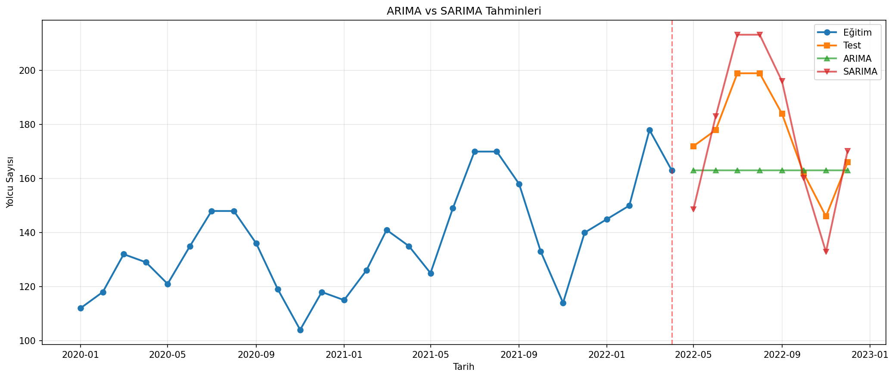
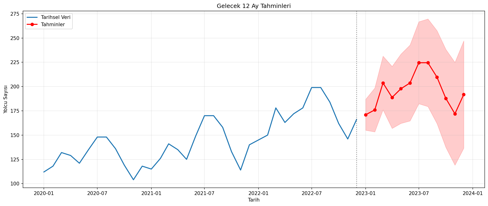

# ARIMA ve SARIMA ile Yolcu Talebi Tahmini

Aylık yolcu sayısını kronolojik eğitim–test ayrımıyla modelleyen ve mevsimsiz ARIMA ile mevsimsel SARIMA sonuçlarını karşılaştıran zaman serisi çalışması.

## Problem ve yöntem seçimi

Zaman serilerinde rastgele veri bölme gelecek bilgisinin geçmişe sızmasına yol açabilir. Bu nedenle son %20’lik dönem test için ayrıldı. ARIMA trend ve otokorelasyonu; SARIMA ise bunlara ek olarak 12 aylık mevsimsel yapıyı modellemek için kullanıldı.

## Veri seti

| Dosya | Boyut | Dönem |
|---|---:|---|
| `data/monthly_passengers.csv` | 36 aylık gözlem | Aylık yolcu sayısı |

## Analiz akışı

1. Veriyi tarih indeksine dönüştürme
2. Kronolojik %80 eğitim, %20 test ayrımı
3. ADF testiyle durağanlık kontrolü
4. `auto_arima` ile model derecelerini seçme
5. ARIMA ve SARIMA modellerini aynı test dönemi üzerinde karşılaştırma
6. En iyi modelle gelecek 12 ay için tahmin ve güven aralığı üretme

## Sonuçlar

| Model | RMSE | MAE |
|---|---:|---:|
| ARIMA | 21,32 | 17,25 |
| SARIMA | **12,84** | **11,04** |

SARIMA her iki hata ölçütünde de daha iyi sonuç verdi. Bu fark, 12 aylık mevsimselliğin tahmin için anlamlı bilgi taşıdığını gösterir. Veri seti küçük olduğu için sonuçlar uzun dönemli genelleme iddiası taşımaz.

## Görseller

| Test dönemi model karşılaştırması | Gelecek 12 ay tahmini |
|---|---|
|  |  |

## Çalıştırma

```bash
pip install -r requirements.txt
python arima_sarima.py
```

## Teknolojiler

Python, pandas, NumPy, Matplotlib, scikit-learn, statsmodels ve pmdarima.
